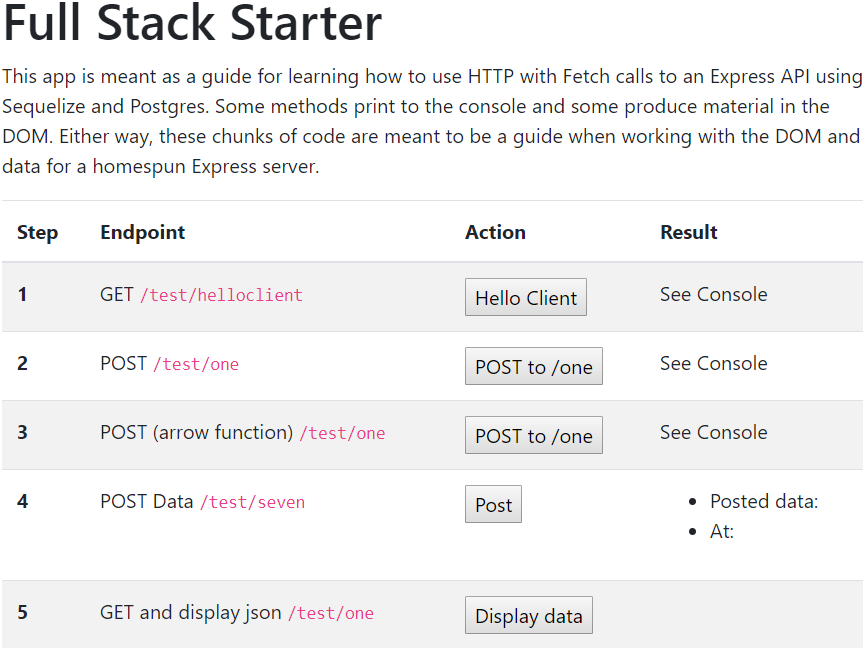

# TEST CLIENT HTML
---
In this module we're going to set up the front end client HTML for testing our requests in the DOM. 

<hr />

### Overview
In this module we'll add some basic HTML and JavaScript on the front end to allow us to learn to interact with our server in a practical way. It's important to know that Postman is acting as a proxy-client for us, a stand in until we get something built on the front end. As we transition to working with a custom client there are some additions that need to be made to our server that Postman didn't need, including more middleware and headers. We'll show you those things in future modules:

### File Structure
Please add a client folder underneath the server folder:

```
    └── 5-Express Server
            └── server
            └── client
                └── 01-scripts.js
                └── index.html
```
<hr>

### Initialize NPM
In order for our client to run on `localhost:8080`, we'll need to add `http-server`. Let's set up npm to allow this to happen:

1. cd into the `client` directory.
2. Run `npm init`. Make sure a `package.json` file is created. 
3. Run `npm install http-server --save`.
4. Your folder structure should now look like this: 

```
    └── 5-Express Server
            └── server
            └── client
                └── node_modules
                └── index.html
                └── package-lock.json
                └── package.json
                └── scripts.js
```

### index.html
Copy the following code into the `index.html` file. Before we talk more about it, use what you know from previous experience with client-side programming to see if you can guess what this code is doing:

```html
<!DOCTYPE html>
<html>

<head>
    <title>Fullstack Starter</title>
	<!--1-->
	<link rel="stylesheet" href="https://maxcdn.bootstrapcdn.com/bootstrap/4.0.0/css/bootstrap.min.css" integrity="sha384-Gn5384xqQ1aoWXA+058RXPxPg6fy4IWvTNh0E263XmFcJlSAwiGgFAW/dAiS6JXm"
        crossorigin="anonymous">
</head>

<body>
    <div class="container">
        <h1>Full Stack Starter</h1>
        <p>This app is meant as a guide for learning how to use HTTP with Fetch calls to an Express API using Sequelize and Postgres.
            Some methods print to the console and some produce material in the DOM. Either way, these chunks of code are
            meant to be a guide when working with the DOM and data for a homespun Express server.</p>
		
		<!--2-->
		<table class="table table-striped">
            <thead>
                <tr>
                    <th scope="col">Step</th>
                    <th scope="col">Endpoint</th>
                    <th scope="col">Action</th>
                    <th scope="col">Result</th>
                </tr>
            </thead>
            <tbody>
                <tr>
                    <th scope="row">1</th>
                    <td>GET
                        <code>/test/helloclient</code>
                    </td>
                    <td>
                        <button onclick="fetchHelloDataFromAPI();">Hello Client</button>
                    </td>
                    <td>See Console</td>
                </tr>
                <tr>
                    <th scope="row">2</th>
                    <td>POST 
                        <code>/test/one</code>
                    </td>
                    <td>
                        <button onclick="postToOne();">Fetch from one</button>
                    </td>
                    <td>See Console</td>
                </tr>
                <tr>
                    <th scope="row">3</th>
                    <td>POST (arrow function)
                        <code>/test/one</code>
                    </td>
                    <td>
                        <button onclick="postToOneCondensed();">Fetch method</button>
                    </td>
                    <td>See Console</td>
                </tr>
                <tr>
                    <th scope="row">4</th>
                    <td>GET and display json
                        <code>/test/one</code>
                    </td>
                    <td>
                        <button onclick="fetchFromOneDisplayData();">Display data</button>
                    </td>
                    <td>
                        <ul>
                        </ul>
                    </td>
                </tr>
                <tr>
                    <th scope="row">5</th>
                    <td>POST Data
                        <code>/test/seven</code>
                    </td>
                    <td>
                        <button onclick="postData();">Post</button>
                    </td>
                    <td>
                        <ul>
                            <li>
                                <bold>Posted data:</bold>
                                <span id="test-data"></span>
                            </li>
                            <li>
                                <bold>At:</bold>
                                <span id="created-at"></span>
                                </p>
                            </li>
                        </ul>
                    </td>
				</tr>            
			</tbody>
        </table>
    </div>

	<!--3-->
    <script src="https://code.jquery.com/jquery-3.2.1.slim.min.js" integrity="sha384-KJ3o2DKtIkvYIK3UENzmM7KCkRr/rE9/Qpg6aAZGJwFDMVNA/GpGFF93hXpG5KkN"
        crossorigin="anonymous"></script>
    <script src="https://cdnjs.cloudflare.com/ajax/libs/popper.js/1.12.9/umd/popper.min.js" integrity="sha384-ApNbgh9B+Y1QKtv3Rn7W3mgPxhU9K/ScQsAP7hUibX39j7fakFPskvXusvfa0b4Q"
        crossorigin="anonymous"></script>
    <script src="https://maxcdn.bootstrapcdn.com/bootstrap/4.0.0/js/bootstrap.min.js" integrity="sha384-JZR6Spejh4U02d8jOt6vLEHfe/JQGiRRSQQxSfFWpi1MquVdAyjUar5+76PVCmYl"
        crossorigin="anonymous"></script>


    <script src="01-scripts.js"></script>
</body>

</html>

```

<br>

### Overview of the HTML
This tutorial assumes you have a basic grasp on HTML, so we'll briefly summarize what we've done. Overall, we're create a single HTML file that will allow us to test our endpoints, but there are a few items to note here:
1. <b>Head:</b> We're not doing any styling, so there are no links to custom CSS files in the head. However, we are going to use Bootstrap, so we did add a CDN link to the Bootstrap CSS file that is needed for building tables.
2. <b>Body Table:</b> We're building a table that will show us how to to access and display our data from the server in the DOM. This just makes an easy to use button system for testing our endpoints.
3. We add Bootstrap.js items and our own custom JavaScript file that we'll use next.

<hr />

### Test
To test this, we'll work in a web browser using `http-server` using the following steps:
1. cd into your client directory.
2. Run `http-server`.
3. Open a browser and go to localhost:8080.
4. You should see the following:
<br />

