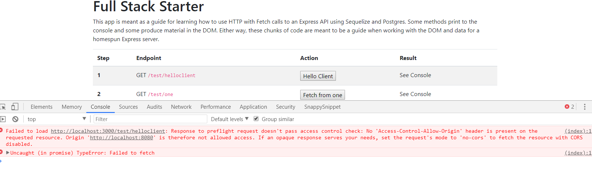

# TEST CLIENT SCRIPTS
---
In this module we're going to start adding the JavaScript functions that will enable us to make client-side requests to our server. 

<hr />

### Overview
So far we've been using Postman to test all of our endpoints. Postman is great, but we want to see how to get the data and start showing it in the DOM. Again, we're just keeping the DOM stuff in a simple Bootstrap table for now, and we're going to be focused solely on getting data into the DOM. We can worry about prettying things up another day.

### Server addition
Just for reorientation, let's add something a little extra in our server:

1. Go to your `testcontroller.js` file in the `controllers` folder.
2. Add the following route:

```js
/************************
 * GET:  Get simple message from server
 ***********************/
router.get('/helloclient', function (req, res) {
  res.send('This is a message from the server to the client.')
})
```

3. Go ahead and save the code.

<hr />

### 01-scripts.js
Now, let's move over to the client side and do the following:
1. Go into the `01-scripts.js` file.
2. Add the following code:

```js
/********************
 * 
 * HTTP REQUESTS
 * 
 ********************/
/*******************************
 * #1 GET: /helloclient
********************************/
function fetchHelloDataFromAPI() {
	fetch('http://localhost:3000/test/helloclient', {
		method: 'GET', 
		headers: new Headers({
		  'Content-Type': 'application/json'
		})
	})
		.then(function (response) {
			console.log("Fetch response:", response)
			return response.text();
		})
		.then(function (text) {
			console.log(text);
		});
}

```

3. Open the index.html file and take a look at where the function gets called:


### Analysis
TODO: Quick breakdown of the function with numbers.....

Use this but label the stuff above with numbers.....
In this function, we're fetching data from the `/test/helloclient` endpoint. Many, if not most, APIs use a similar endpoint for initial testing, which will usually hold a set value. This allows us to ensure that the server is working before we start pulling information from a database. We also use the `Headers()` constructor object to hold our headers, which we'll talk more about in a later module. Finally, we use the `.text()` method here instead of the `.json()` method as we're only returning a single string.


### Test
Let's test it by doing the following:
TODO: Make these directions very clear. Need to add instructions about the ability to have two consoles in VS Code. Up until now, they have not done that....Below is just a start....
1. Start the server side using `nodemon app.js`.
2. Start the client side using `http-server`...
3. You should see an error:



<hr />

TODO: Brief explanation of error. 


Let's do some work on the server.

