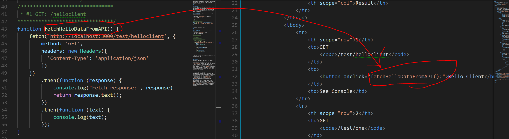
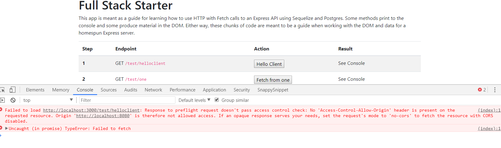

# TEST CLIENT SCRIPTS
---
In this module, we're going to start adding the JavaScript functions that will enable us to make client-side requests to our server. 

<hr />

### Overview
So far, we've been using Postman to test all of our endpoints. Postman is great, but we want to see how to get the data and start showing it in the DOM. Again, we're just keeping the DOM stuff in a simple Bootstrap table for now, and we're going to be focused solely on getting data into the DOM. We can worry about prettying things up another day.

### Server Addition
Just for reorientation, let's add something a little extra in our server:

1. Go to your `testcontroller.js` file in the `controllers` folder.
2. Add the following route:
```js
/************************
 * GET:  Get simple message from server
 ***********************/
router.get('/helloclient', function (req, res) {
  res.send('This is a message from the server to the client.')
})
```
3. Go ahead and save the code.

<hr />

### 01-scripts.js
Now, let's move over to the client side and do the following:
1. Go into the `01-scripts.js` file.
2. Add the following code:
```js
function fetchHelloDataFromAPI() {
	fetch('http://localhost:3000/test/helloclient', { //1
		method: 'GET', 
		headers: new Headers({ //2
		  'Content-Type': 'application/json'
		})
	})
		.then(function (response) {
			console.log("Fetch response:", response)
			return response.text(); //3
		})
		.then(function (text) {
			console.log(text);
		});
}
```
3. Open the `index.html` file and take a look at where the function gets called:


### Analysis
1. Test endpoint with fixed value to verify server works.
2. Send our headers to the server with the `Headers()` constructor object. We'll talk more about this in a later module.
3. The value received is a string, not a JSON object, so `.text()` is used instead of `.json()`


### Test
Let's test it by doing the following:

1. In your console window in VS Code, click the `+` sign to open a new console window. You can switch between windows using the dropdown next to the `+`. You can also right-click a folder in the File Explorer and select `Open in Command Prompt`(Windows) or `Open in Terminal` (Mac) to open a console window in that specific folder.
2. Navigate to your server folder and start the server side using `nodemon app.js`.
3. *NOTE: If you client is already running, skip this step.* Open another new terminal window, navigate to the client folder, and start the client side using `http-server -o`. This will start the client and automatically open a new tab in your browser at 127.0.0.1:8080 (same as localhost:8080). 
4. Click any of the buttons on screen. You should see an error:



<hr />

### CORS
When a client and server are both running at the same time, they run on different ports. By default, a server won't recognize any transmission coming from a different URL than its own, and it will refuse to acknowledge the request. This is known as a `CORS` error, which stands for **Cross Origin Resource Sharing**. We can fix errors like this with files known as *middleware*, which we'll talk more about in the next chapter.