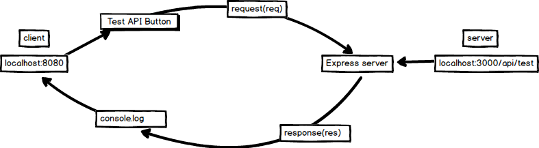

# APP.JS UPDATE
---
We added some routes to `app.js` earlier, but didn't cover what was really happening there. In this module we'll add to the `app.js` file, giving it the ability to use middleware. We'll also try testing out the additional routes we added earlier, as well as use the test client to see how the client and server sides work together.

<hr />

### Referencing the middleware
We exported the middleware, now we need to use it when we spin up our server. Follow the steps:
1. Go into `app.js`.
2. Add the following code under the `bodyParser` variable:

```js
var bodyParser = require('body-parser');
//1
var headers = require('./middleware/headers');

sequelize.sync(); // tip: {force: true} for resetting tables

app.use(bodyParser.json());
//2
app.use(headers);

});

```
### Analysis
1. We're creating a variable instance to our headers file just like we do for packages.
2. This allows our server access to the headers file so that it can use the headers

### Testing
Let's use Postman to test this api use the following steps:
1. Start the server using `nodemon app.js`.
2. Open up Postman.
3. Enter the URL:
`http://localhost:3000/api/test`
4. Press send in Postman. 
5. You should see the following result:

 

### Test Client
Now that we've seen how the routes work, let's try the ones we added earlier for our test client. Your server should still be running, so we just need to start the client. Open up a new terminal window. Navigate to your client folder and run `http-server`. Go to your client and try clicking on the buttons. You should see the text change when you click the buttons, as well as information stored in the database and printed to the console. We are finally displaying the response we've received back from our server!

### Further Study
Look at this picture of the client-server relationship:
 <br>
Explain the entire process, from the client creating of the request to receiving the response back from the server.