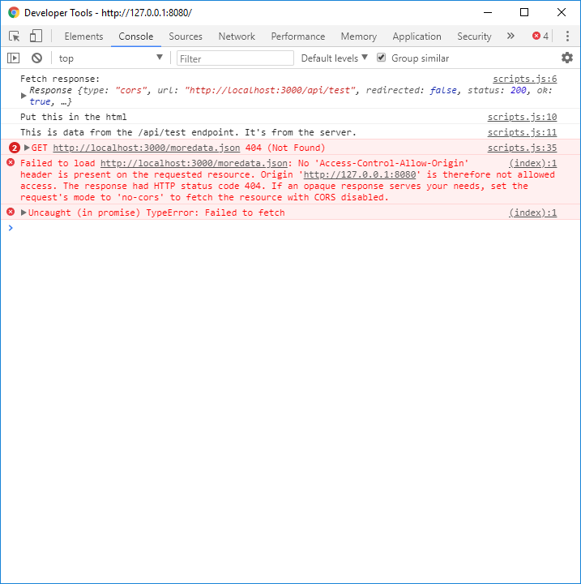

# MIDDLEWARE INTRO
---
In this module we'll start to address the error that we ran into in the last module with our client request.

### MIDDLEWARE
Sometimes our client and server don't communicate well. Data can get lost or damaged during transmission, unexpected extra data could be included, or a host of other issues. This module will introduce you to a type of code that is designed to help these transmissions go as smoothy as possible: Middleware.

**Middleware** lives in the space between the client and the server. Its job is to facilitate the process of sending data between the two, as well as ensuring that no unwanted data accidentally gets passed along with the request or response. It can also be used to help prevent external users from accessing transmissions that could then be used to compromise our system. Middleware is an additional checkpoint that must be successfully navigated in order for our transmission to reach its desired destination.

### Define CORS
When a client and server are both running at the same time, they run on different ports. By default, a server won't recognize any transmission coming from a different URL than its own and it will refuse to acknowledge the request, which can look like this:     

This is known as a `CORS` error, which stands for **Cross Origin Resource Sharing**. One of the main purposes of middleware is to tell the server to allow transmissions coming from outside locations. We can choose to allow any outside traffic, no outside traffic, or specific locations. We do this with properties called `headers`, which we'll discuss in the next module.