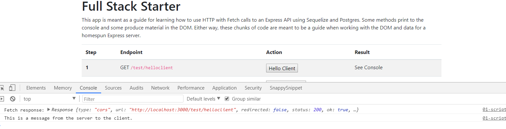
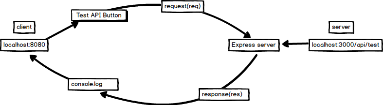

# HEADERS IN OUR SERVER
---
In this module, we'll add header files in our server.

<hr />

### Overview
We added some routes to `app.js` earlier but didn't cover what was really happening there. In this module, we'll add to the `app.js` file, giving it the ability to use middleware. We'll also try testing out the additional routes we added earlier, as well as use the test client to see how the client and server sides work together.

<hr />

### Referencing the Middleware
We exported the middleware, so now we need to use it when we spin up our server. Follow the steps:
1. Go into `app.js`.
2. Add the following line of code under the `bodyParser` variable:
<br>
```js
sequelize.sync(); // tip: {force: true} for resetting tables
app.use(bodyParser.json());
app.use(require('./middleware/headers')); //1 Add it here.
app.use('/test', test);
app.use('/api/user', user);
app.listen(3000, function(){
	console.log('App is listening on 3000.')
});
```

### Analysis
1. Here we activate our headers in the `app.js`. Keep in mind that this in order, so the file will be read sequentially, which means that the headers must come before the routes are declared.
 
<hr />

### Test Client
Let's test this in our client now with the following steps:

1. Your server should still be running, so we just need to start the client. Switch to the client terminal window and start it.
2. Go to your client and try clicking on the button that says **Hello Client**. You should see the result print to the console. Please note this is the only button that currently works.



### Further Study
Look at this picture of the client-server relationship:
 <br>
Explain the entire process, from the client creating of the request to receiving the response back from the server.