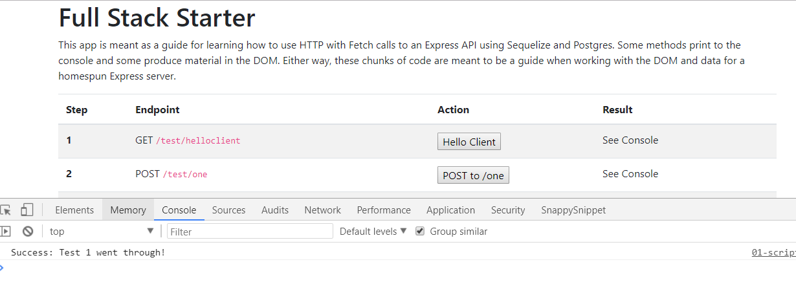

# fetchFromOne() Method
---
In this module we'll write another client side function that access our server. 

<hr>

### Overview
This time, we'll be testing our POST request from the `test/one` endpoint that we already built, which will pull from the database instead of a pre-defined value. We'll chain promises together to create a flow chart for our `fetch`. 

### Scripts
Let's add the function now. It should go directly below the first function in `01-scripts.js`:
```js

/******************************
 * 2 POST long hand: /one 
 *****************************/
function postToOne(){
	var url = 'http://localhost:3000/test/one';
	
	fetch(url, {
	  method: 'POST', 			//1
	  headers: new Headers({
		'Content-Type': 'application/json'
	  })
	}).then(
		function(response){   //2
			return response.text()
		})
	.catch(
		function(error){   //3
			console.error('Error:', error)
		})
	.then(
		function(response){   //4
			console.log('Success:', response);
		})
}

```
### Quick Summary
We are not seeing new stuff here, but let's do a quick summary:
TODO:
1. 
2. 
3. 
4. 

Leftover description:
 If successful, perform the action in the second `.then()`. If not, go to the `catch()`. Just another way of handling errors.


<hr>

### Test

1. Make sure that both your client and server are running.
2. Go to localhost:8080
3. Click the `POST to /one` button.
3. You should see the following success message:

