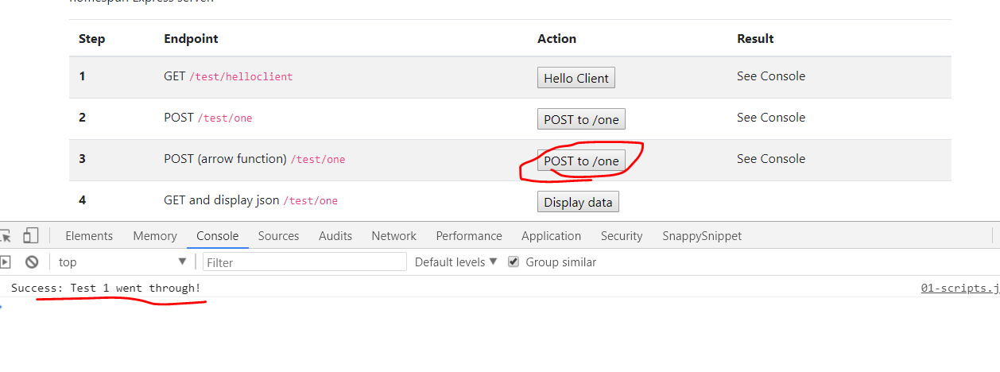

# postToOneArrow() Method
---
In this module, we'll refactor our last method so that it is more streamlined and using ES6 principles. 

<hr>

### Overview
Right below the `postToOne` method, let's write another method. We'll test that same endpoint, except we'll write our function in a more concise form. This is helpful to know because it is common to see the use of arrow functions as we look ahead to React. Also, it can make our code much more streamlined. 

### Scripts
Let's add the function now. It should go directly below the first function in `01-scripts.js`:
```js
  /***************************************
 * 3 POST /one : Arrow Function
*************************************/
function postToOneArrow(){
	var url = 'http://localhost:3000/test/one';
	
	fetch(url, {  //1
	  method: 'POST', 
	  headers: new Headers({
		'Content-Type': 'application/json'
	  })
	}).then(res => res.text()) //2
	.catch(error => console.error('Error:', error)) //3
	.then(response => console.log('Success:', response)); //4
}

```
### Quick Summary
This is the same function as the one above it that we wrote in the last module, only we use arrow functions instead of callbacks. You can see how much more simplified and easier to read this can be, saving us from potential "Callback Hell". Our function is doing the same thing:

1. We're reaching out to an endpoint with a POST request. We add the appropriate headers. 
2. We are asking for a plain text response. 
3. We handle an error, if there is one. 
4. In the end, we simply print the data to the console.  

<hr>

### Test

1. Make sure that both your client and server are running.
2. Go to `localhost:8080`
3. Click the `POST to /one` button in Step #3.
3. You should see the following success message:


