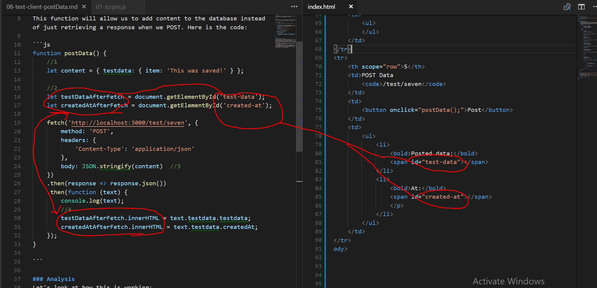
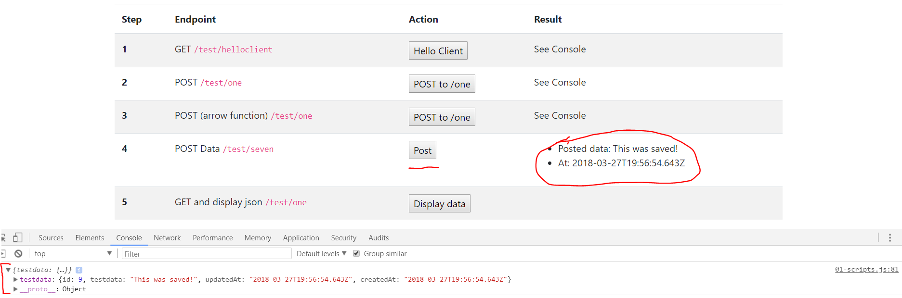

# postData()
---
In this module we'll send some data to our test route to store in the database. Then we'll show some data in the DOM.

<hr/>

### Overview
This function will allow us to add content to the database instead of just retrieving a response when we POST. Here is the code:

```js
function postData() {
	//1
	let content = { testdata: { item: 'This was saved!' } };
	
	//2
	let testDataAfterFetch = document.getElementById('test-data');
	let createdAtAfterFetch = document.getElementById('created-at');

	fetch('http://localhost:3000/test/seven', {
		method: 'POST',
		headers: {
			'Content-Type': 'application/json'
		},
		body: JSON.stringify(content)  //3
	})
	.then(response => response.json())
	.then(function (text) {
		console.log(text);
		//4
		testDataAfterFetch.innerHTML = text.testdata.testdata; 
		createdAtAfterFetch.innerHTML = text.testdata.createdAt;
	});
}

```

### Analysis
Let's look at how this is working:
1. We set up an object, just like we would have in Postman. We have a preset string as the value of the `item` property.
2. We target some specific ids in the DOM. These elements will hold the value of the response that comes back after the post is stored. Here's a screenshot to show you what we're pointing to in the DOM.
3.  We pass in our pre-defined object into the `fetch` call within the `body` property. Notice that the `method` property is now `POST` instead of `GET`. 
4. Our response comes back and is printed to the console, and it is also displayed to the user along with the timestamp. We access the separate values by calling `text.testdata`. In the DOM, the `innerHTML` property allows us to take the plain text that we get back and display it in the targeted element. 

Here is a quick screenshot to highlight how the DOM is being targeted here:



### Test
Let's test the code to ensure that things are working:
1. Make sure that both your client and server are running.
2. Go to localhost:8080.
3. Press the POST button. Open the console.
4. This is how it should look:
