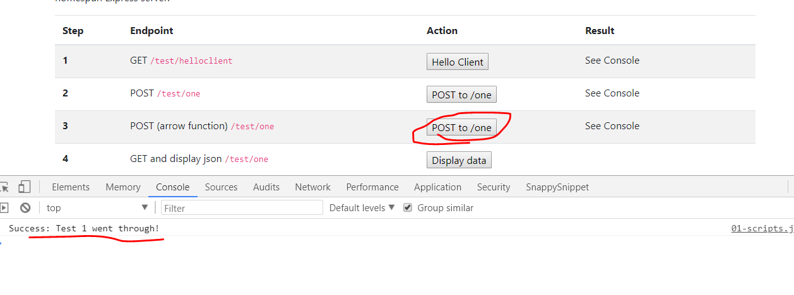

# fetchFromOneDisplayData();
---
In this module we'll access the /one endpoint and do a GET request to access data for display in the DOM.  

<hr>

### Overview
Right below the `postToOneArrow` method, let's write another method. This time we'll pull in the data and think through the starter logic of showing it in the DOM. This book assumes that you have some knowledge of the DOM and DOM manipulation, but we also will try to talk in a way that starts from square one.

### Server Addition
When writing applications, it's common to have to toggle between the front end and back end. With that being said, let's add another route in the `testcontroller.js` file. This can be anywhere in the file. 

```js
/************************
 * GET:  /one
 ***********************/
router.get('/one', function(req, res) {

  TestModel
	.findAll({ //1
    	attributes: ['id', 'testdata']
	})
	.then(
		function findAllSuccess(data) {
			console.log("Controller data:", data);
			res.json(data);
		},
		function findAllError(err) {
			res.send(500, err.message);
		}
	);
});
```

###Analysis
1. Notice that we find the attributes for two of the columns: `id` & `testdata`. The other columns will not be pulled from. Be sure to save!

After we add that, let's go add our `fetch` display. 

<hr />

### Scripts
Let's add the function now. It should go directly below the last function in `01-scripts.js`:

```js
/***************************************
 * 4 GET FROM /ONE - Display Data
*************************************/
function fetchFromOneDisplayData(){
	let url = 'http://localhost:3000/test/one';
	let dataView = document.getElementById('display-one');
	fetch(url, {
	  method: 'GET', 
	  headers: new Headers({
		'Content-Type': 'application/json'
	  })
	}).then(
		function(response){
			return response.json()
		})
	.catch(
		function(error){
			console.error('Error:', error)
		})
	.then(
		function(response){
			let text = '';
			var myList = document.querySelector('ul');

			for (r of response){
				// console.log('T:', r.testdata);
				// console.log("TEXT:", text);
				var listItem = document.createElement('li');
				listItem.innerHTML = r.testdata;
				myList.appendChild(listItem);
			}
		})
}
```

### Quick Summary
This is the same function as the one above it, only we use arrow functions instead of callbacks. You can see how much more simplified and easier to read this can be, saving us from potential "Callback Hell". Our function is doing the same thing. We're reaching out to an endpoint with a POST request. We add the appropriate headers. We are asking for a json response. We handle an error, if there is one. In the end we simply print the data to the console.  

<hr>

### Test

1. Make sure that both your client and server are running.
2. Go to localhost:8080
3. Click the `POST to /one` button in Step #3.
3. You should see the following success message:


