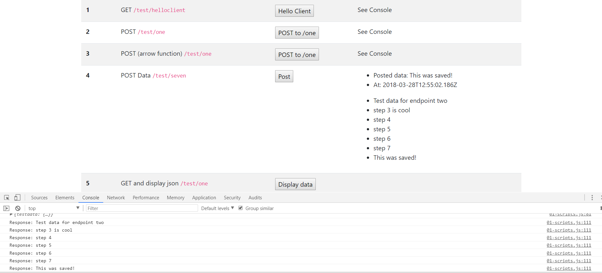

# fetchFromOneDisplayData();
---
In this module, we'll create and access the `/one` endpoint and do a `GET` request to access data for display in the DOM.  

<hr>


### Server Addition
When writing applications, it's common to have to toggle between the front-end and back-end. With that being said, let's add another route in the `testcontroller.js` file. This can be anywhere in the file, but we'll put it just before `module.exports = router`. 

```js
/************************
 * GET:  /one
 ***********************/
router.get('/one', function(req, res) {

  TestModel
	.findAll({ //1
    	attributes: ['id', 'testdata']
	})
	.then(
		function findAllSuccess(data) {
			console.log("Controller data:", data);
			res.json(data);
		},
		function findAllError(err) {
			res.send(500, err.message);
		}
	);
});
```

###Analysis
1. Notice that we find the `attributes` for two of the columns: `id` & `testdata`. This is part of sequelize. If you are querying an entire table, you can choose which columns you want to grab from. The other columns will not be queried, which can save time for a giant table. 

Be sure to save the changes to your server.
<hr />

### Overview
Let's go back to the client and into the `01-scripts.js` file. Right below the `postData` method, let's write another method. This time we'll pull in the data and think through the starter logic of showing it in the DOM. Here is the code to be added:

```js
/***************************************
 * 4 GET FROM /ONE - Display Data
*************************************/
function fetchFromOneDisplayData(){
	//1
	let url = 'http://localhost:3000/test/one';
	let dataView = document.getElementById('display-one');   

	//2
	fetch(url, {
	  method: 'GET', 
	  headers: new Headers({
		'Content-Type': 'application/json'
	  })
	}).then(
		function(response){
			return response.json()
		})
	.catch(
		function(error){
			console.error('Error:', error)
		})
	.then(
		function(response){
			let myList = document.querySelector('ul'); //3

			for (r of response){  //4
				console.log('Response:', r.testdata); //5
				var listItem = document.createElement('li');  //6 
				listItem.innerHTML = r.testdata; //7
				myList.appendChild(listItem); //8
			}
		})
}
```

### Summary
Let's break this down:

1. We set up our URL in one variable and target the `data-one` id in the DOM in another one. 
2. We create a `fetch()` with `Headers`and therequest method of `GET`. There are also chained promises that handle the data when it returns or handle an error if one comes back. 
3. Inside the final `.then()`, we are going to work towards showing the returned data in the DOM. We start by targeting the first `ul` in the DOM and attaching the value of the `myList` variable. 
4. We set up a `for of` loop. 
5. We write a `console.log()` statement to show how we can access the values that come back in the object inside the response.
6. We create another variable called `listItem`. The `createElement()` method will create that type of element in the DOM. In this case, we create a list item, `li`, every time we iterate.
7. Each time we iterate, we store the value of `r.testdata` in the newly create `li`.
8. We call `appendChild` on `myList`, which means that each time we iterate we put the `li` into the unordered list. 

### Quick Summary for the DOM Work
Just to succinctly summarize the last `then()`: 

* We target a list, `myList`.
* We iterate over the response object with a `for of` loop.
* Each time we iterate, we create a list item.
* The value gets stored in the `innerHTML` of the `li`.
* We append the list item to an unordered list.  
* We continue until we get to the end of the response object.

<hr>

### Test

1. Make sure that both your client and server are running.
2. Go to `localhost:8080`
3. Click the `Display Data` button in Step #5.
3. You should see the following success message:



