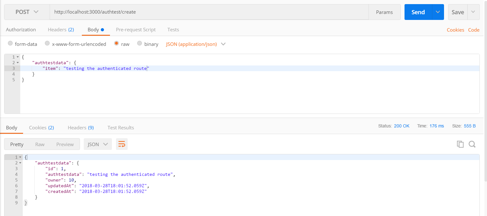
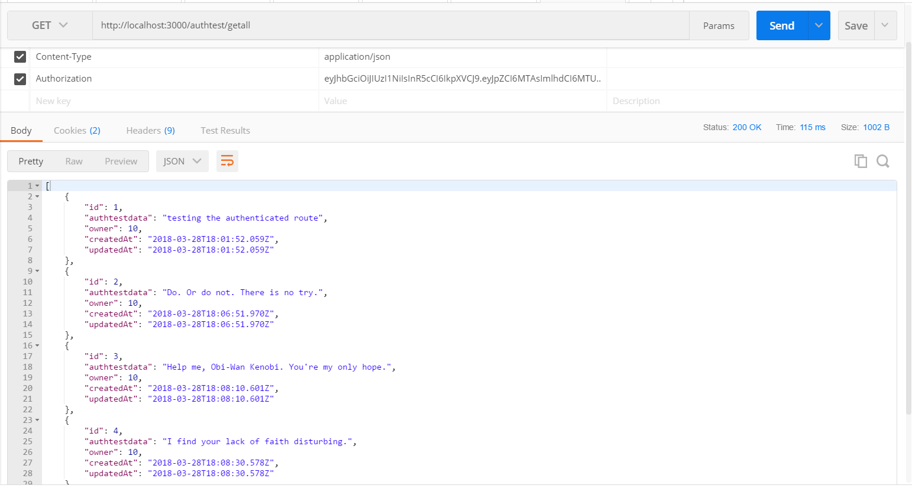
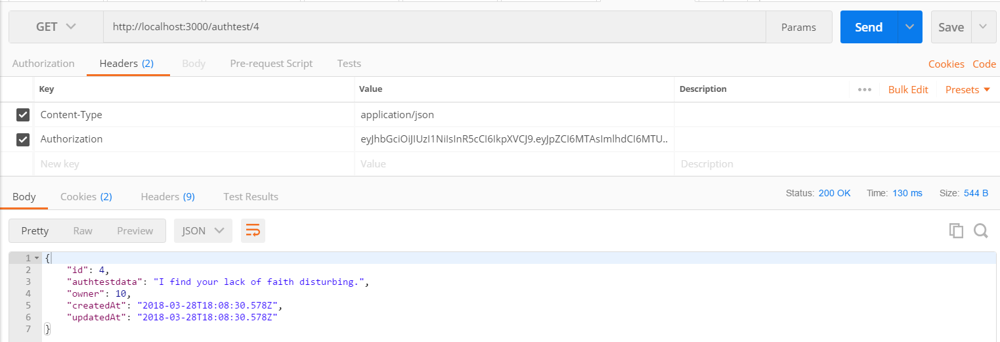
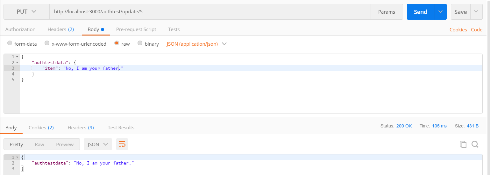

#TESTING
---
In this module, we'll quickly test our routes with Postman. We want to run 8 tests between the user and authtest controllers:

1. Create a new user.
2. Get a new token.
3. Set up the headers with the proper token.
4. Create an item with a specific user.
5. Get all items for a specific user.
6. Get a single item for a specific user.
7. Update an item for a specific user.
8. Delete an item for a specific user.

After each step, check the relevant table in your database to make sure that everything worked properly. There are screenshots below to show you how each request should look, but try to do them by yourself first.

### Screenshots fot tests:

Test your Endpoints:
1. Create a new user.

2. Get a new token. 

3. Set up the headers with the proper token.

4. authtest/create screenshot

5. Test `authtest/getall`.

6. Test Get single item by user `authtest/1`

7. Test `authtest/update/1`. Change something.

8. Test `authtest/delete/1`. Change something.

