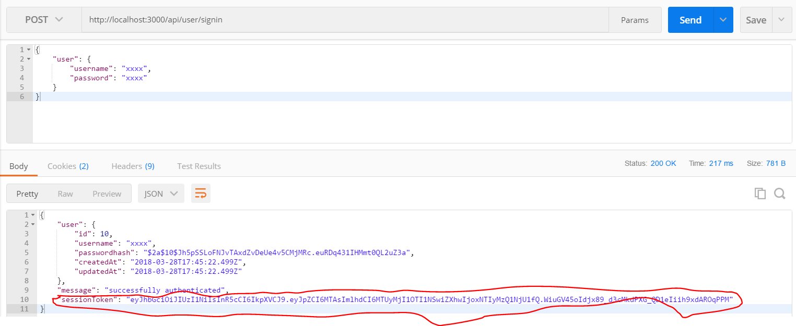
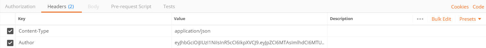
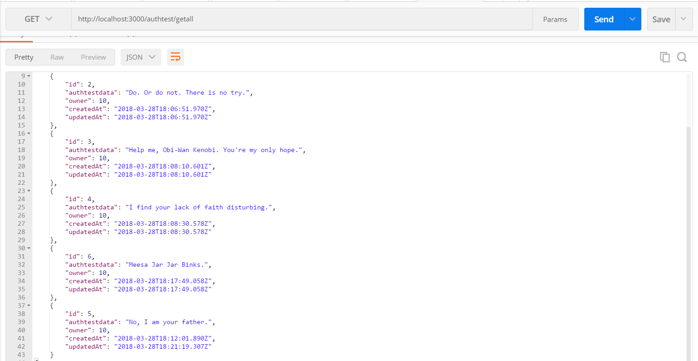
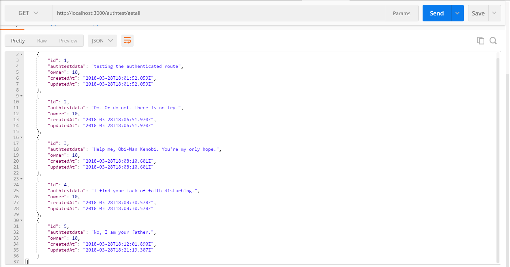

#TESTING
---
In this module, we'll quickly test our routes with Postman. We want to run 8 tests between the user and authtest controllers:

1. Create a new user.
2. Get a new token.
3. Set up the headers with the proper token.
4. Create an item with a specific user.
5. Get all items for a specific user.
6. Get a single item for a specific user.
7. Update an item for a specific user.
8. Delete an item for a specific user.

Try to do each by yourself first. There are screenshots below to help if you need.

### Screenshots fot Tests:

Test your Endpoints:
1. Create a new user.

2. Get a new token. 

3. Set up the headers with the proper token. Just copy and paste the token you just got. And our application is returning json.

4. Create an item with a specific user `authtest/create`.

5. Get all items for a specific user `authtest/getall`. We added a few items.

6. Get a single item for a specific user `authtest/id`.

7. Update an item for a specific user `authtest/update/id`. If you have more than one item, the updated one will move to the bottom of the list.

Had to get the quote right obviously.
8. Delete an item for a specific user `authtest/delete/id`.

It's like the Gungans never existed.
