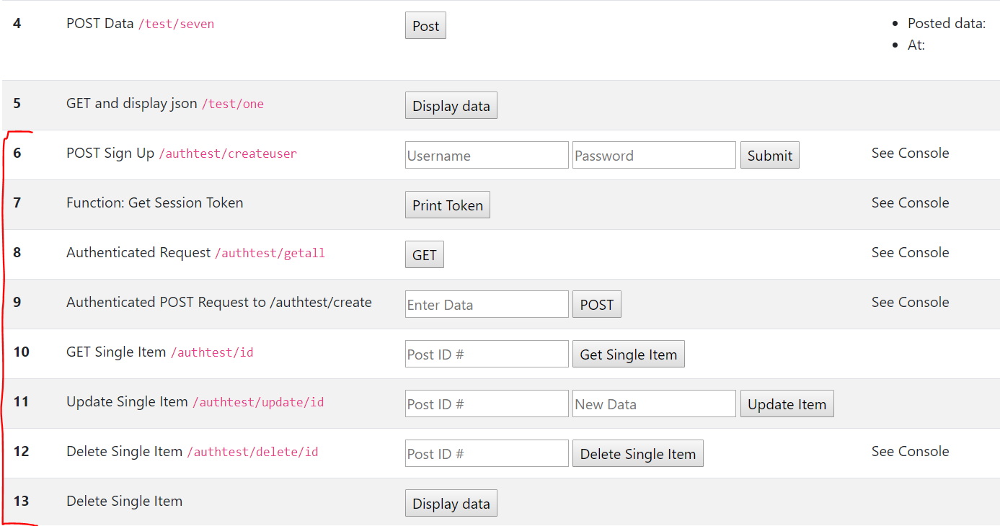

# HTML ADDITIONS
---
Before we get started working on our client on making authenticated requests to our authenticated routes, we'll add more code to our HTML file. 

<hr />

### Code
Add the following code to our current `index.html` file. NOTE: You will be adding to the existing table in the file. These are more rows for that table. You will add this code under the closing `</tr>` tag in the 5th row. Please copy and paste the following code for now:

```html
<!--PASTE THIS CODE AFTER ROW 5-->
                <tr>
                    <th scope="row">6</th>
                    <td>POST Sign Up
                        <code>/authtest/createuser</code>
                    </td>
                    <td>
                        <span>
                        <input type="text" id="user" placeholder="Username" />
                        </span>
                        <span>
                        <input type="password" id="pass" placeholder="Password" />
                        </span>
                        <span>
                        <button onclick="userSignUp();">Submit</button>
                        </span>
                    </td>
                    <td>
                        See Console
                    </td>
                </tr>
                <tr>
                    <th scope="row">7</th>
                    <td>Function: Get Session Token</td>
                    <td>
                        <button onclick="getSessionToken();">Print Token</button>
                    </td>
                    <td>
                        See Console
                    </td>
                </tr>
                <tr>
                    <th scope="row">8</th>
                    <td>Authenticated Request
                        <code>/authtest/getall</code>
                    </td>
                    <td>
                        <button onclick="fetchAllFromAuthRoute();">GET</button>
                    </td>
                    <td>
                        See Console
                    </td>
                </tr>
                <tr>
                    <th scope="row">9</th>
                    <td>Authenticated POST Request to /authtest/create</td>
                    <td>
                        <input type="text" id="authTestData" placeholder="Enter Data"/>
                        <button onclick="postToAuthRouteCreate();">POST</button>
                    </td>
                    <td>
                        See Console
                    </td>
                </tr>
                <tr>
                    <th scope="row">10</th>
                    <td>GET Single Item
                        <code>/authtest/id</code>
                    </td>
                    <td>
                        <input type="text" id="getNumber" placeholder="Post ID #"/>
                        <button onclick="getOneByUser();">Get Single Item</button>
                    </td>
                    <td>
                        <label id="getItemValue"></label>
                    </td>
                </tr>
                <tr>
                    <th scope="row">11</th>
                    <td>Update Single Item
                        <code>/authtest/update/id</code>
                    </td>
                    <td>
                        <input type="text" id="updateNumber" placeholder="Post ID #"/>
                        <input type="text" id="updateValue" placeholder="New Data"/>
                        <button onclick="updateItem();">Update Item</button>
                    </td>
                    <td>
                        <label id="newItemValue"></label>
                    </td>
                </tr>

                <tr>
                    <th scope="row">12</th>
                    <td>Delete Single Item
                        <code>/authtest/delete/id</code>
                    </td>
                    <td>
                        <input type="text" id="deleteNumber" placeholder="Post ID #"/>
                        <button onclick="deleteItem();">Delete Single Item</button>
                    </td>
                    <td>
                        See Console
                    </td>
                </tr>
                <tr>
                    <th scope="row">13</th>
                    <td>Delete Single Item</td>
                    <td>
                        <button onclick="fetchFromOneDisplayData();">Display data</button>
                    </td>
                    <td>
                        <ul id="thirteen">
                        </ul>
                    </td>
                </tr>
```

### Analysis
Take a minute to check through the additions. Notice that we've added the following:
1. 8 more table rows 
2. Buttons, lists, labels, and input fields added to various rows.
3. Classes and ids in elements for future use.  
4. Names of functions that we will soon create.

### Test
1. You should see something similar to the following when you run the application:
