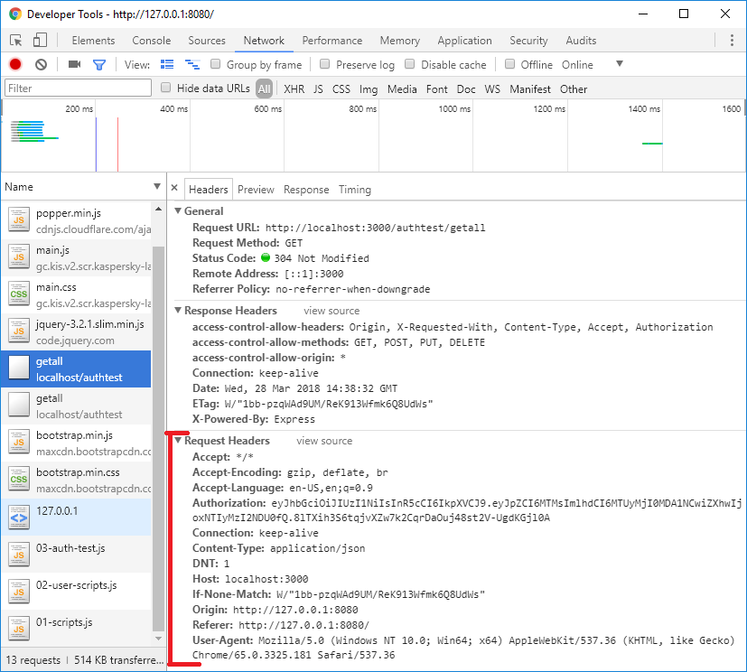

# REQUEST DISCUSSION
---
In this module we'll go deeper into discussing the request/response lifecycle and examine how requests interact with our middleware and server.

### Anatomy of the Request
It's important to note that there is a lot going on under the hood with requests in general. This complexity is in part to adhere to HTTP protocols and to manage security and traffic between domains.  Let's dig in and look underneath the surface a little bit.  

When we complete a `fetch` here, we are kicking off a multi-step process in this request. It goes something like this:

### Analysis
1. When the method fires off, `fetch()` notifies the browser to send a Pre-Flight from `localhost:8080`.
2. The browser fires off an OPTIONS request. `OPTIONS` is an HTTP verb, like GET, POST, PUT, DELETE. Check on the Postman list, you'll see it there. The `OPTIONS` verb allows the client to determine the options associated with our server without having to dig in and do data retrieval or deal with resources in the server. It's an intermediary between domains that says, "Hey, will we be able to do this here if we come in?"
3. The OPTIONS HTTP protocol checks in with the Headers on the server for the request type. So, if we fire off a GET request for a certain route, the server does an initial scan and checks to be sure that the type of request can happen.
4. If the request type is enabled in the server, specifically the headers, the OPTIONS response is sent back with the listing of that request type. 
5. If the PreFlight OPTIONS request determines that the request is allowed, the fetch method fires off and the request for data can be made.Notice the Allow: POST in the Response.

6. The fetch() script fires off the second request approved by the PreFlight check. 
7. The second request makes it to the server endpoint and processes the request.
8. The server sends back a response. 
 

### The important points:
1. Before it sends off the GET or POST request to the server, the browser performs a `pre-flight` check.  

2. If everything checks out with our PreFlight request, the server responds with a `200 OK` and fetch follows with the request/response that has been proclaimed (`GET`, `POST`, `PUT`, etc.), seen here:     

