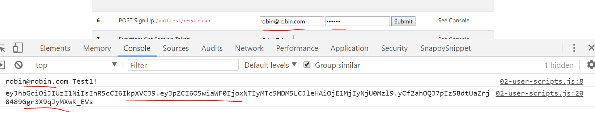

# CLIENT SETUP
---
In this module we'll add a client method for creating a user. 
<hr />

### User Scripts
Please add a `02-user-scripts.js` file inside of the client folder:

```
    └── 5-Express Server
            └── server
            └── client
                └── 01-scripts.js
                └── 02-user-scripts.js
                └── index.html
```
We'll add some of our auth logic in this file.

### Script Tags
Follow these steps to wire up the `js` file:
1. Go to `index.html`.
2. Go to the bottom of that same file, under the Bootstrap scripts and the `01-scripts.js` file, and add the `02-user-scripts.js` tag like this:

```html

    <script src="01-scripts.js"></script>
    <script src="02-user-scripts.js"></script>

</body>

</html>

```

<hr />

### userSignUp
At the top of this new script file,`02-user-scripts.js`, let's add the code for signing up a user:

```js
/********************
 * POST - /createuser
*********************/
function userSignUp(){
	let userName = document.getElementById('user').value; //1
	let userPass = document.getElementById('pass').value;
	console.log(userName, userPass);

	let newUserData = {user : { username: userName, password: userPass}}; //2
	fetch('http://localhost:3000/api/user/createuser', {
		method: 'post',
		headers: {
			'Content-Type': 'application/json'
		},
		body: JSON.stringify(newUserData) //3
	})
	.then(response => response.json())
	.then(function (response) {
		console.log(response.sessionToken);
		let token = response.sessionToken; //4
		localStorage.setItem('SessionToken', token);  //5
	});
}
```

<hr />

### Analysis
1. Here we are grab the value of the data from the input field in the `index.html` file.
2. The variables used to store the sign up info from the DOM get passed into the values of the `username` and `password` properties. We package everything up in a user object.
3. In the request object in our fetch call, we pass in the `newUserData` variable to be sent off in the body of our request to the server.
4. We get the token from the response and store it in a `token` variable.
5. In our `localStorage` we call the `setItem` function and store the token in localStorage. This will keep our token safely stored in our local window.

<hr />

### Test
1. Let's run the client and server again. 
2. Open up the client in the browser. Go to step 6. 
3. Sign up with a new user and press send. You should see the following:

4. Notice that we have a token printing in the console window.
5. You should also crack open Postgres, refresh your database, and look at the User table. You should see the new user added there now.


