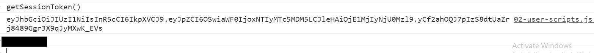
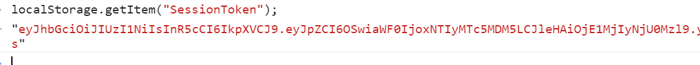
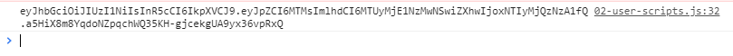

# SESSION TOKEN
---
Let's just create a function that will print our token and print it in the console. 

### Code
It is often handy to have a function that retrieves the session token. Let's write a basic token. You can add this directly under our last function in `02-user-scripts.js`:

```js
/****************************
 * HELPER FUNCTION FOR TOKEN
*****************************/
function getSessionToken(){
	var data = localStorage.getItem('SessionToken');
	console.log(data);
	return data;
}
```

Then, you can save, and run the app. If you call the function in the console, it will print:




This is handy for passing the token around in our app, but it's also handy to access the token for testing purposes. 

### Another Way
Another way to access your token is simply by calling the localStorage.getItem("SessionToken") method:




### Test

Note that we've made a spot in the DOM for the `getSessionToken()` method. Let's test that:

1. Make sure that both the server and client are running.
2. Open the console.
3. Go to Step 7. 
4. Click the button to print the token to the console:
