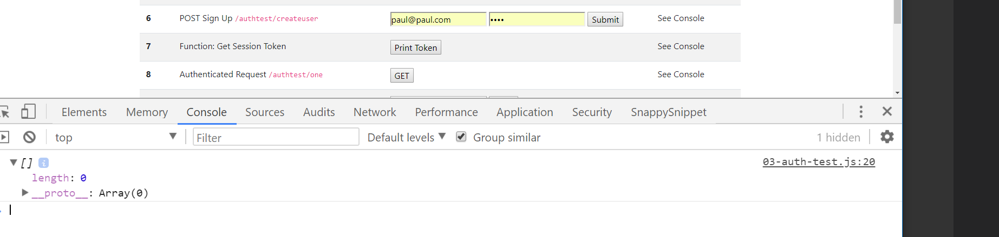

# AUTH TEST
---
In this module we'll add a client method for making an authenticated request with a token to an authenticated route. 

<hr />

### Authenticated Request Defined
Authentication is the process of identifying whether a client is eligible to access a resource. An authenticated request usually means that a client has some token or cookie allowing access to a resource. Hence, for clarity in this book, we'll refer to Authenticated Requests as being synonmous with a user that has a token. Think of it as a user that is logged in. 


### Auth Test
Let's add a `03-auth-test.js` file inside of the client folder:

```
    └── 5-Express Server
            └── server
            └── client
                └── 01-scripts.js
                └── 02-user-scripts.js
                └── 03-auth-test.js
                └── index.html
```
We'll add all of our authenticated request logic in there.

We'll also need to add the script tag to the bottom of the `index.html` file:

```html
    <script src="01-scripts.js"></script>
    <script src="02-user-scripts.js"></script>
    <script src="03-auth-test.js"></script>

</body>

</html>
```

### Code
Add the following code to `03-auth-test.js`:

```js
/***************************************
 * GET from /authtest/one
*************************************/
function fetchFromAuthRouteOne () {
	const fetch_url = `http://localhost:3000/authtest/one`;
	const accessToken = localStorage.getItem('SessionToken') //1

	const response = fetch(fetch_url, {
		method: 'GET', //2
        headers: {
          'Content-Type': 'application/json', //3
		  'Authorization': accessToken, //4
		}
	})
	.then(response => {
		return response.json();
	})
	.then(data => {
		console.log(data)
	})   
}

```

### Analysis
1. Since we stored our token in `localStorage`, we can access it by using the `getItem` method to get it back from localStorage and put it in a variable. Note that we could also use our `getSessionToken()` method for this task. 
2. By default, `fetch` runs a `GET` request. We can use the `method` property to send other requests. In this case, we're still sending a `GET`.
3. The `Content-Type` header tells the server what kind of data is being sent in our PreFlight request, if any. 
4. The `Authorization` header provides some sort of encrypted data allowing access to the server, in this case our token.

<hr />

### Test

1. Make sure both the server and client are running.
2. Open the console.
3. Go to Step 8. 
4. Press the button. You will probably see an empty array:
