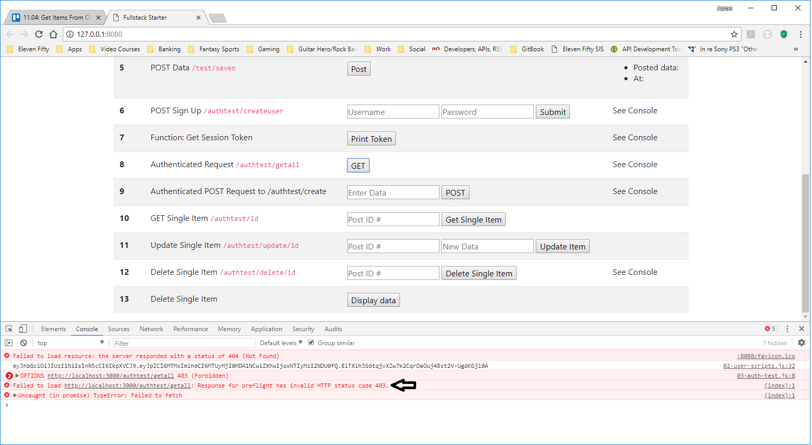
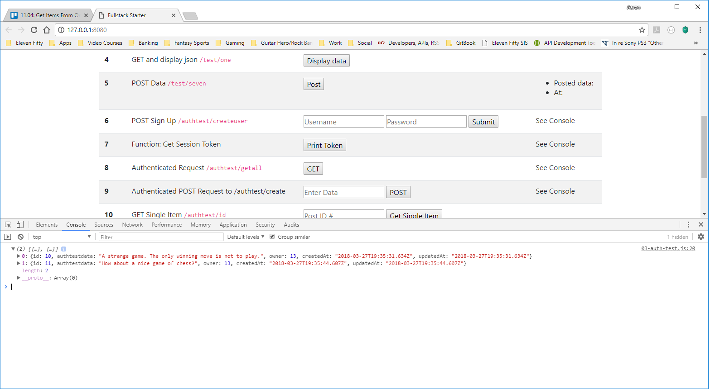

# CREATING AN AUTHENTICATED REQUEST
---
In this module, we'll add a client method for making an authenticated request with a token to an authenticated route. 

<hr />

### Authenticated Request Defined
Authentication is the process of identifying whether a client is eligible to access a resource. An authenticated request usually means that a client has some token or cookie allowing access to a resource. Hence, for clarity in this book, we'll refer to Authenticated Requests as being synonmous with a user that has a token. Think of it as a user that is logged in. 


### Auth Test
Let's add a `03-auth-test.js` file inside of the client folder:

```
    └── 5-Express Server
            └── server
            └── client
                └── 01-scripts.js
                └── 02-user-scripts.js
                └── 03-auth-test.js
                └── index.html
```
We'll add all of our authenticated request logic in there.

We'll also need to add the script tag to the bottom of the `index.html` file:

```html
    <script src="01-scripts.js"></script>
    <script src="02-user-scripts.js"></script>
    <script src="03-auth-test.js"></script>

</body>

</html>
```

### Code
Add the following code to `03-auth-test.js`:

```js
function fetchAllFromAuthRoute() {
	const fetch_url = `http://localhost:3000/authtest/getall`
	const accessToken = localStorage.getItem('SessionToken') //1

	const response = fetch(fetch_url, {
		method: 'GET', //2
		headers: {
			'Content-Type': 'application/json', //3
			'Authorization': accessToken //4
		}
	})
		.then(response => {
			return response.json();
		})
		.then(data => {

			console.log(data)
		})
}
```

### Analysis
1. Since we stored our token in `localStorage`, we can access it by using the `getItem` method to get it back from localStorage and put it in a variable. Note that we could also use our `getSessionToken()` method for this task. 
2. By default, `fetch` runs a `GET` request. We can use the `method` property to send other requests. In this case, we're still sending a `GET`.
3. The `Content-Type` header tells the server what kind of data is being sent in our PreFlight request, if any. 
4. The `Authorization` header provides some sort of encrypted data allowing access to the server, in this case our token.

<hr />

### Test

1. Make sure both the server and client are running.
2. Open the console.
3. Go to Step 9. 
4. Press the button.

You should see an error similar to the following image: <br>  <br>
The problem isn't with our code here. The problem lies with a file on the server side: the `validate-session.js` file, and specifically how that file handles the pre-flight `OPTIONS` request sent by our browser.

### Small Refractor to `validate-session.js`
As a reminder, here is the `validate-session` function:
```js
module.exports = function(req, res, next) {
	// if (req.method == 'OPTIONS') {
	// 	next()
	// } else {
		var sessionToken = req.headers.authorization; //PROBLEM IS RIGHT HERE
		console.log(sessionToken)
		if (!sessionToken) return res.status(403).send({ auth: false, message: 'No token provided.' });
		else {
			jwt.verify(sessionToken, process.env.JWT_SECRET, (err, decoded) => {
				if(decoded){
					User.findOne({where: { id: decoded.id}}).then(user => {
						req.user = user;
						next();
					},
					function(){
						res.status(401).send({error: 'Not authorized'});
					});
				} else {
					res.status(400).send({error: 'Not authorized'});
				}
			});
		}
	//}
}
```
Notice the parts that are commented out: the `if` statement at the top and the corresponding `else`. When we used Postman to test, we never sent an `OPTIONS` request. Here is the result of that request: <br>  <br>
You can see that there isn't an `Authorization` header on that request, so when `validate-session` looks for `req.headers.authorization`, it comes back undefined, breaking the rest of the function. That's where this conditional comes into play. One of the properties on `fetch` is `method`; This is where we tell fetch what type HTTP request to send (`GET`, `POST`, etc.). This conditional allows us to tell the program to let any request where `req.method` is `OPTIONS` through without checking for a session token. This way the pre-flight check can occur, then the program will look for and verify a token on any other request. <br>

Un-comment the `if/else` statement at the top, as well as the closing curly bracket at the bottom, then run the test above again. It should go through this time. However, since you've just created your user, you will probably see an empty array. This is coming from the Postgres table:
