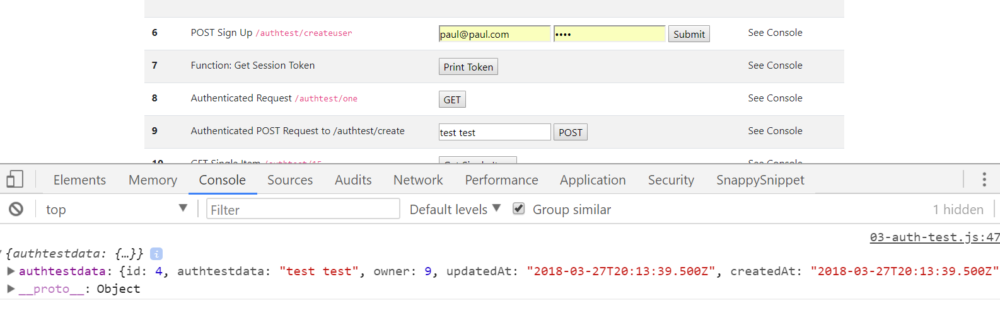

# AUTH TEST CREATE
---
In this module, we'll make an Authenticated `POST` request to an authenticated `POST` route and persist some simple data in the database.

<hr />

### Code
Let's start by adding the following code to `03-auth-test.js`:

```js
/***************************************
 * FETCH/POST to Auth/Create
*************************************/
function postToAuthRouteCreate() {
	const fetch_url = `http://localhost:3000/authtest/create` 
	const accessToken = localStorage.getItem('SessionToken')

	let authTestDataInput = document.getElementById('authTestData').value; //1

	let authInputData = { authtestdata: { item: authTestDataInput } }; //2

	const response = fetch(fetch_url, {
		method: 'POST', //3
		headers: {
			'Content-Type': 'application/json',
			'Authorization': accessToken
		},
		body: JSON.stringify(authInputData)  //4
	})
		.then(response => {
			return response.json();
		})
		.then(data => {
			console.log(data)
		})
}
```

### Analysis
1. We will be using an input field in the DOM for this exercise, so we will grab whatever string that a user passes into that field. 
2. We package that value up into an object. Notice that this object is similar in syntax to what we did with Postman when posting data. 
3. Note that we are identifying this method as a POST request. If you are struggling with request problems, it's a good idea to take a look at your HTTP verb and make sure that you are using the right one. Since the server endpoint requires a POST request, we have to send the data as a POST request. GET would not work because we did not write our server endpoint as a GET request.
4. We package up the object as a JSON string and add it to the body of our request. The `JSON.stringify()` method will take a JS object and convert it into JSON.

<hr />

### Test
1. Make sure your client and server are both running.
2. Go to step 9 (Authenticated POST Request to /api/user/create) and enter something into the input field.
3. Press send, then check the console. You should see something similar to following response:
 
4. Note that the response will hold whatever value that you added to the input field.
5. Just for practice and orientation, it's also a good idea to go and see how this data has saved to Postgres. Refresh the `authtestdata` table and redo the query.

### Task
For the next few modules you'll need an `id` number of the item you've just created. For instance, in the screenshot above, our `id` number is '4'. Yours will probably be '1' or '2'. Just make sure that you remember that number value.  