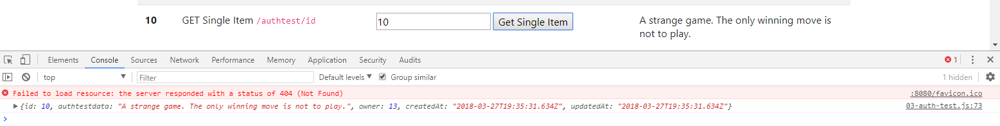

# GET SINGLE ITEM
---
In this module we'll write a GET request that grabs a single item from the database for a specific user.

<hr />

### CODE
Add the following method to the `03-auth-test.js` file:

```js
/***************************************
 * GET ITEM BY USER
*************************************/
function getOneByUser() {
	let postIdNumber = document.getElementById("getNumber").value; //1

	const fetch_url = `http://localhost:3000/authtest/${postIdNumber}` //2
	const accessToken = localStorage.getItem('SessionToken')

	const response = fetch(fetch_url, {
		method: 'GET',
		headers: {
			'Content-Type': 'application/json',
			'Authorization': accessToken
		}
	})
		.then(response => {
			return response.json();
		})
		.then(function (response) {
			console.log(response); 
			var myItem = document.getElementById('getItemValue'); //3
			myItem.innerHTML = response.authtestdata; //4
		})
}
```

### Analysis
1. We get the post ID number provided in the `getNumber` field. Because we are making an authenticated request, this id has to exist for the user that you are using currently logged in as (The user that has a token stored in your localStorage).
2. We pass the post ID number into the url with a template literal.
3. We target an element called `getItemValue`. It's a `label` tag.
4. We set the value of the label to the value of `response.authtestdata`. This means that the data will be populated in the label when the DOM loads.

<hr>

### Test
1. Go ahead and run the app. 
2. Click the `Get Single Item` button. 
3. You should see the following:

4. Notice that we have pulled the single item from the server. In our case, the item has the id of `10`. 
5. Not only did we print to the console, we added the data pulled from the server to the DOM in the label element on step 10.