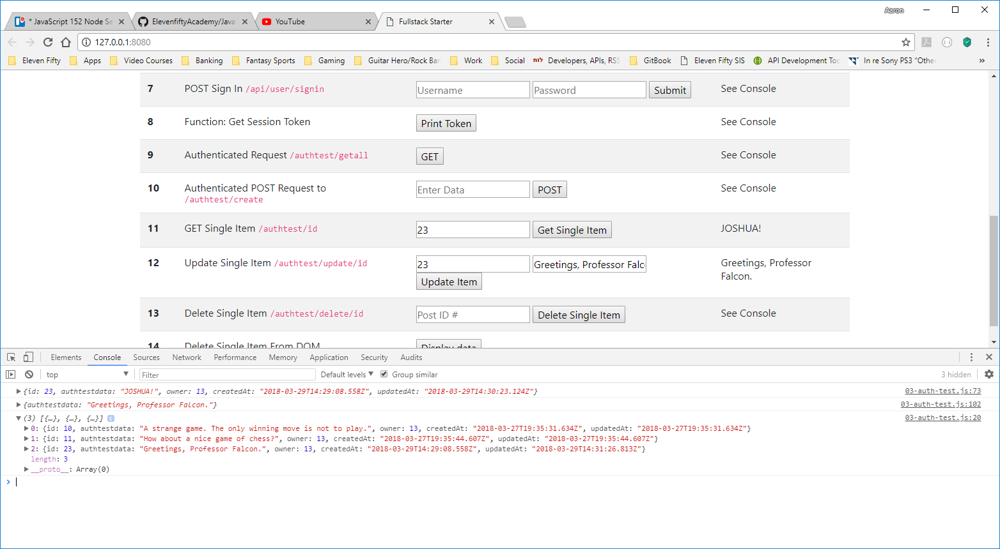
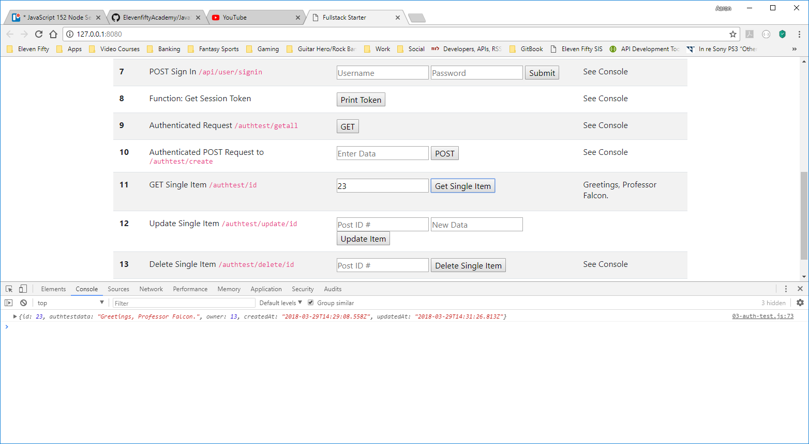

# UPDATE ITEM
---
In this module, we'll update the item that is returned from the GET request and displayed in the input field. 

### CODE
Add the following code to your `03-auth-test.js` file. 

```js
/***************************************
 * PUT to authtest/update/:id
*************************************/
function updateItem() {
	let postIdNumber = document.getElementById("updateNumber").value; 
	let authTestDataInput = document.getElementById('updateValue').value; //1

	const fetch_url = `http://localhost:3000/authtest/update/${postIdNumber}` //2
	const accessToken = localStorage.getItem('SessionToken')

	let authInputData = { authtestdata: { item: authTestDataInput } }; //3
	const response = fetch(fetch_url, {
		method: 'PUT', //4
		headers: {
			'Content-Type': 'application/json',
			'Authorization': accessToken
		},
		body: JSON.stringify(authInputData) //5
	})
		.then(response => {
			return response.json();
		})
		.then(data => {
			console.log(data) //6
			var myItem = document.getElementById('newItemValue') //7
			myItem.innerHTML = data.authtestdata; //7
			fetchAllFromAuthRoute(); //8
		})
}
```

1. We get the value of the input provided from the user for both the `updateNumber` and `updateValue` fields and assign each to a variable.
2. Like before, we pass in the input from the user to the url with a template literal.
3. We create an object that packages up our request. We capture the value of `authTestDataInput` and store it in the variable `authInputData` variable.
4. We are doing an update method, so this will be a `PUT` request. 
5. Just like we did in past `POST` methods, we use the `stringify` method to convert the object to a JSON object.
6. We print the response to our fetch to the console.
7. We make a reference to the `<label>` in step 12 (Update Single Item), then set its value to the data we put in the database.
8. We run the `getall` function again and print the new contents of the database to the console.

### TEST
1. Make sure that the server and client are running.
2. Press the `GET Single Item` button on Step 11. That label should populate.
3. Change the text in the input field while keeping the same ID# in the input field of Step 12 so that it is something different than what you had.
4. Press the `Update Item` button. 
5. You should see the following response in the console. The current contents of the database should also print after the update runs:

6. Go ahead and refresh the page. You don't need to turn off the Client or Server.
7. Press the `GET Single Item` button on Step 11. The label should populate again.
8. You should see that the newly updated data in the label and console message:

9. We might also suggest that you check in Postgres to be sure that you have successfully added the data to the database.

<hr>

### Getting Fancy
While we're here, let's mess around about with the stuff we're getting from the database. Go to your `index.html` file and look for Step 12. We're going to add a little bit to one of the input fields:
```html
				<tr>
                    <th scope="row">12</th>
                    <td>Update Single Item
                        <code>/authtest/update/id</code>
                    </td>
                    <td>
                        <input type="text" id="updateNumber" placeholder="Post ID #" onkeyup="showCurrentData(this)"/> <----- ADD THIS
                        <input type="text" id="updateValue" placeholder="New Data"/>
                        <button onclick="updateItem();">Update Item</button>
                    </td>
                    <td>
                        <label id="newItemValue"></label>
                    </td>
                </tr>
```
You've used listeners in the past, but this time instead of adding one in JavaScript, we're using the HTML attribute `onkeyup`. This listener looks for a key on the keyboard being released; in other words, after you press the key down, it waits until a key is released then does whatever you tell it to. <br>
We're adding the listener to the `updateNumber` input field, so anytime a key is released while that field is focus (i.e. we're typing something in the field), the function attached to the listener will run. `this` is passed as a parameter into our function. Here, `this` refers to the input field itself, which will allow us to easily access the value of the field in out function. <br>
If you look at the button, you can see another one of these listener attributes `onclick`. That one allows us to make the button do something without having to make it a `submit` type. In fact, all of the buttons on this page have that listener attached.

### showCurrentData()
The goal of this listener is to automatically search our database for an `id` that matches what we've entered into the `updateNumber` field, then populate the `updateValue` filed with the data that is returned. Add this code to the bottom of your `03-auth-test.js` file:
```js
function showCurrentData(e) { //1
	const fetch_url = `http://localhost:3000/authtest/${e.value}` //2
	const accessToken = localStorage.getItem('SessionToken')

	fetch(fetch_url, {
		method: 'GET',
		headers: {
			'Content-Type': 'application/json',
			'Authorization': accessToken
		}
	})
		.then(response => {
			return response.json();
		})
		.then(function (response) {
			console.log(response);
			var myItem = document.getElementById('updateValue'); //3
			if (!response) return; //4
			else myItem.value = response.authtestdata; //5
		})
}
```

### Analysis
1. `e` is the default variable name for an Event Listener. Here, `e` represents the input field `updateNumber`, which was passed as a parameter using `this` on the HTML page.
2. We pass the value of the input field directly into the URL with a template literal. Because `e` is already defined as the input field, we don't need to use a function to get another reference to it.
3. We call the DOM element we want to modify and set it to a variable to be accessed later.
4. If no item in the database matches the id we've supplied, response comes back undefined. A blank return statement tells the program not to return anything and just to move on. Remember that not only does the id have to match what's in the database, but `user.id` also has to match the `owner` property, signifying that the current user is the one who entered it.
5. We could use `innerHTML` to set the value, but that method doesn't work with `<input>` elements. Instead, we use `value` to insert our data into the field.

### Testing
1. If your client and server should still be running; if not, restart them.
2. Refresh your browser, then type a number into the first field in step 12.
3. If nothing in the database matches the id you've entered, you should see something like this:
 <br>
4. If a match is found, you should see something like this:
 <br>
5. You can then change the text however you'd like. Click `Update Item` and refresh your database to make sure it worked.

This process allows you to see what's in the database before you replace it. Most users, if not all, won't have direct access to the database, so this is one way that can show them what's already saved for a particular item. 