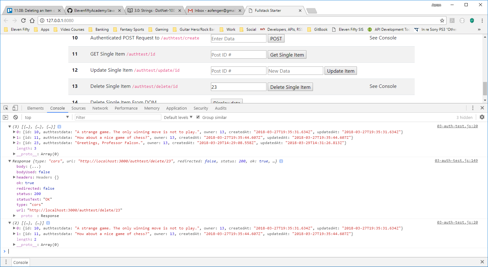

# DELETE
---
In this module we'll write a method to delete a single item in the database. 

<hr />

### CODE
Add the following method to the `03-auth-test.js` file:

```js
function deleteItem() {
	const fetch_url = `http://localhost:3000/authtest/delete/4` // <----Add the id number that you've been using. #1
	
	const accessToken = localStorage.getItem('SessionToken')

	const response = fetch(fetch_url, {
		method: 'DELETE', //2
		headers: {
			'Content-Type': 'application/json',
			'Authorization': accessToken
		}
	})
		.then(response => {
			console.log(response);
		})
}
```

### Analysis
This method is simple so far. Let's do two simple explanations.
1. Again we add the correct id number. Our endpoint requires an id number. 
2. Our HTTP verb is DELETE in this case, so we use the `DELETE` method.  

<hr />

### Test
1. Run the client and server.
2. Press the `Delete` button.
3. Then, press the `Get Single Item` button from Step 10. 
4. You should see the following response:

5. Notice that the item is now showing as NULL. Why? Because it no longer exists in the database. 