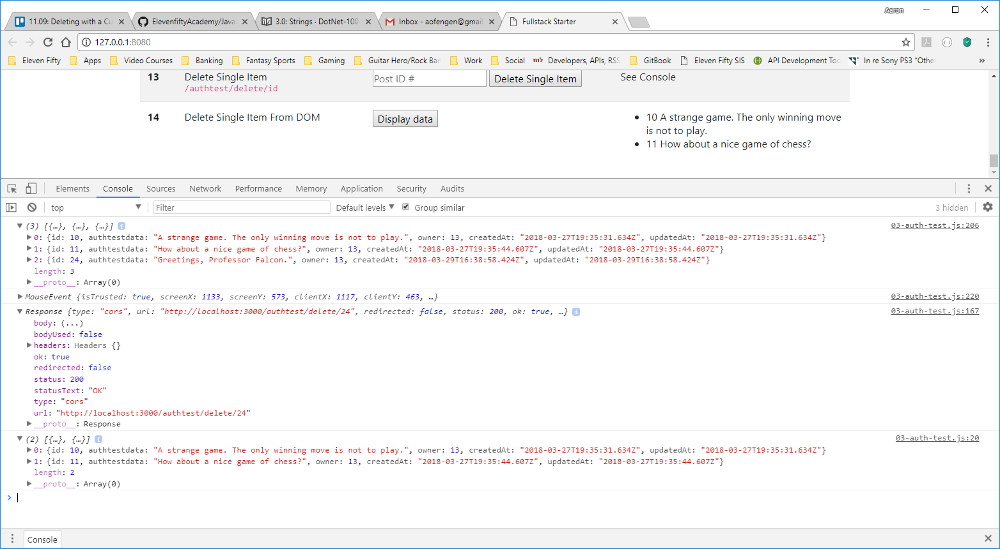

# DELETE WITH AN EVENT
---

The last step we have is to display a list of all the items for a given user. However, we're going to add a custom click listener to each item so that when item is clicked, it immediately deletes that item from the database. We'll do the display function first, then the delete.

### Display All Items for a User
Put this at the bottom of your `03-auth-test.js` file. We'll cover what's happening here in a moment:
```js
function fetchFromOneDisplayData() {
	const url = 'http://localhost:3000/authtest/getall';
	const accessToken = localStorage.getItem('SessionToken')

	fetch(url, {
		method: 'GET',
		headers: new Headers({
			'Content-Type': 'application/json',
			'Authorization': accessToken
		})
	}).then(
		function (response) {
			return response.json()
		})
		.catch(
			function (error) {
				console.error('Error:', error)
			})
		.then(
			function (response) {
				let text = '';
				var myList = document.querySelector('ul#thirteen'); //1
				while (myList.firstChild) { //2
					myList.removeChild(myList.firstChild)
				}

				console.log(response);
				for (r of response) { //3
					var listItem = document.createElement('li'); //4
					var textData = r.id + ' ' + r.authtestdata; //5
					listItem.innerHTML = textData;
					listItem.setAttribute('id', r.id); //6
					myList.appendChild(listItem); //7
					myList.addEventListener('click', removeItem);  //8
				}
			})
}
```

### Analysis
1. This is a little different way of making a reference to a DOM element. We're aiming for a `<ul>` element with an id of `thirteen` (the `#` signals the program to look for an id rather than a class).
2. This should look familiar to you. This is the same way we cleared out the `<section>` elements in the NYT and YouTube API mini-apps.
3. We use a `for of` loop to iterate through the values of each `key: value` object pair.
4. Given that we're working with an `<ul>` element, each loop will create a different `<li>`.
5. We create a string with the `id` and `authtestdata` properties, then put that string into the `<li>` element.
6. We add the `id` property of each object as an id for each `<li>`. This will allow us to call them individually later.
7. The `<li>` child element is added to the end of the `<ul>` parent element.
8. We add our custom listener to run whenever an `<li>` is clicked.

<br>

We need to create the `removeItem` function before we test this part out or the app will break.

### removeItem()
This function will delete an item from the `<ul>` element. It will also have the ability to send a `DELETE` request, but we're going to hold off on that part for a second. Add this function at the bottom of the `03-auth-test.js` file:

```js
function removeItem(e) {
	console.log(e); //1
	var target = e.target; //2
	if (target.tagName !== 'LI') return; //3
	else target.parentNode.removeChild(target); //4

	let x = target.getAttribute("id") //5
    //deleteItemById(x); //6
    console.log("The id number for this item is " + x);
}
```

### Analysis
1. Print `e` to the console to check which item we're clicking on.
2. `target` is a nested object within `e`. This places that object inside its own variable.
3. If the item we're clicking on isn't an `<li>` element, the empty return statement exits the conditional.
4. We remove the `<li>` child from the `<ul>` parent.
5. Earlier we set an id for the `<li>`. Now we get it back so we can pass it to the `DELETE` request.
6. This will become our `DELETE` request. So we can test what we have so far, we'll just print `x` to the console.

### Testing

1. If they aren't already running, start your client and server.
2. Refresh your browser, then click on `Display data` in step 13.
3. You should see the items from the `authtestdata` table with the matching `owner` value for our current user token:

4. Click on one of the items. It should disappear from the list and print something like the following to the console:


Now that we can remove the element from it's parent, we need to send a `DELETE` request to remove the item from the database. One last step and we're done!

### deleteItemById()
Since this is a `DELETE` request, put this function between the `deleteItem()` and `fetchFromOneDisplayData()` functions:
```js
function deleteItemById(paramNum) { //1
	const fetch_url = `http://localhost:3000/authtest/delete/${paramNum}`
	const accessToken = localStorage.getItem('SessionToken')

	const response = fetch(fetch_url, {
		method: 'DELETE',
		headers: {
			'Content-Type': 'application/json',
			'Authorization': accessToken
		}
	})
		.then(response => {
			console.log(response);//2
			fetchAllFromAuthRoute();//3
		})
}
```

### Analysis
Before we go further, go to the `removeItem()` function. Comment out the last line (the `console.log`) and uncomment out the line before it, which triggers this function. This functions nearly identically to the previous delete method, so it should look familiar.

1. The `id` of the `<li>` is passed into this function as a parameter, which is then added to the url via the template literal.
2. Print the response to the console to verify the delete worked.
3. Run the `getall` function again to print the remaining items in the database to the console.

Now for the final test. Follow the instructions above, but this time you should see something like this: <br>
**Pre-delete** <br>
 <br>
**Post-delete** <br>


### Wrap Up
And that's it! That's everything you need to build your own CRUD app, both client side and server side. If there's anything that you find unclear, please ask us so that we can help, but try on your own first. The next step is a new challenge so when you're ready, move on to the next chapter.