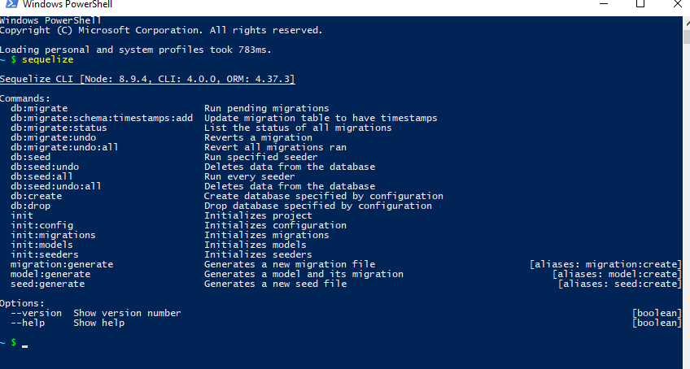

# CHANGING A DATABASE
---

Databases can grow quite large over time. They also frequently need to be updated, adding or removing information as a project or app changes. Currently, the only way we have to accomplish this is to change the model, drop the table or database, then re-create it with `sequelize.sync()`. This creates a giant problem: If you have 1000 user accounts on a website and you change the user table to add some information, dropping the user table would wipe out all of these accounts! This is a problem not only for the users that get deleted, along with any associated information, but will undoubtedly make your users very, very mad. Fortunately, `sequelize` gives us a way to update the database without losing everything: **Migrations**.

### What are Migrations?
Simply put, migrations are a way to alter a database or table while keeping the data that's already there. This can also be done with SQL statements, but can be very risky if you aren't sure exactly what you're doing. This approach uses JavaScript and the sequelize-cli (Command Line Interface), and poses a much smaller risk to your database, and by extension your users.

### Migration Set-up
Before we start actually doing migrations, we have to install a few npm packages. You can just install them locally within your project, but it's much simpler to install them globally. This saves time by not having to re-install the packages for every single project you create. Open a console window and run the following commands:

```
npm install -g sequelize
npm install -g sequelize-cli
npm install -g pg
```
*NOTE: Mac users may need to use the `sudo` command if the computer requires admin access*

These commands install sequelize, the sequelize-cli, and postgres on your computer, and the global installation allows access to them from anywhere. Anytime you install something to be used via the command line, you need to close the terminal window and re-open it to use what you've installed. After re-opening the window, type `sequelize` into the command line. You should see something like this: <br>
 <br>
If you see any errors, try running the above steps again. Once the cli is working, move on to the next module.

### Further Reading
This chapter will be following instructions laid out in the official Sequelize Migration Tutorial, found [here](http://docs.sequelizejs.com/manual/tutorial/migrations.html). Feel free to take a look if you want to learn more.