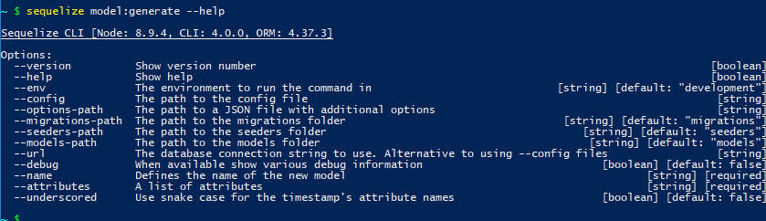
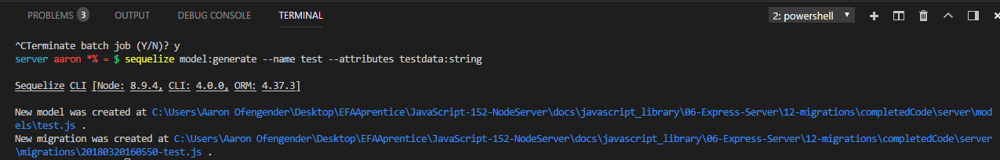

# CREATING YOUR FIRST MIGRATION
---

To create a migration, we first need to create a model. Even though we have models already, they need to be in a specific format to allow migrations.

### Creating the Model and First Migration
In your terminal window, type the following: `sequelize model:generate --help`. This will bring up the following: <br>
 <br>
While there are many different options, we want to focus on `--name` and `--attributes`. These are required in order to create the model. `--name` will be the name of our model (and become the name of the table in the database), while `--attributes` will be the information we want to store (these will become the columns in our table). In your terminal, type the following command:
```
sequelize model:generate --name test --attributes testdata:string
```
You should see the following: <br>  <br>
This will create a model in the `models` folder called `test`. Take a look at what was created:
```js
'use strict';
module.exports = (sequelize, DataTypes) => {
  var test = sequelize.define('test', {
    testdata: DataTypes.STRING
  }, {});
  test.associate = function(models) {
    // associations can be defined here
  };
  return test;
};
```
Notice that the model is a little different than what we had before. The `associations` function allow you to create connections between tables within your database, making use of primary and foreign keys. We'll just leave that blank for now. <br>

Another file was also created in the migrations folder: `XXXXXXXXXXXXXXX-test.js`. The `X`'s are automatically generated. You should see today's date at the beginning; the rest is created according to an algorithm. This is the file that will be used for our first migration, which we'll look at in the next module.