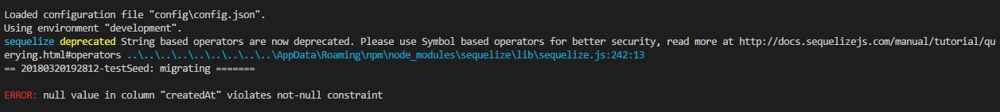
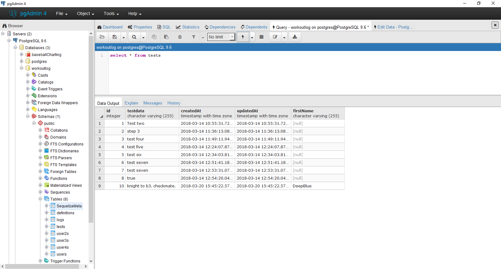

# SEEDS
---

So far we've only entered data into our database via Postman, but that isn't the only way to do so. You can obviously create a webpage to bring data fro the client side, but you can also add data via the sequelize-cli by using `seeds`. This can be an easy way to build in an admin-level user into your database to bypass security settings while in testing, or to create a backdoor for you to have access to later for updates.

### What is a Seed?
Simply put, a seed is a file containing information that you want to enter into a database. It's nearly identical to a migration file; the only difference being that a seed adds a row of data instead of a column. The structure of a seed file is the same as a migration file: It exports an `up` and a `down` function. Seeds can be called once or multiple times.

### Creating a Seed
We create a seed just like a model or a migration using the command `seed:generate`. Like the migration, the ony attribute needed is `--name`. Let's create a seed called `testSeed`:
```
sequelize seed:generate --name testSeed
```
You should see the following in your console: <br>  <br> Notice that it attempts to create the seeders file, which is skipped because it already exists. It then creates a file in the seeders folder with the long string of numbers. This file is the same as the blank migration file. This time, we'll use the `bulkInsert()` and `bulkDelete()` methods. Add the following code in the designated function:

```js
//This goes in the up function
return queryInterface.bulkInsert('tests', [{
        testdata: 'testing. testing. testing.',
        firstName: 'DeepBlue'
      }], {});

//This goes in the down function
return queryInterface.bulkDelete('tests', null, {});
```

### Seeding the Database
You can run a single seed by using `db:seed [filename]` We're going to use the command to send all seeds at once. When you're ready, run `sequelize db:seed:all` to push the information in the `up` function into the database. If you have more than one seed, they'll all be inserted at the same time. You should see something like this: <br>  <br>

Can you guess why it didn't work? The `createdAt` and `updatedAt` columns must have a non-null value inside of them, and these time-stamps are usually automatically generated. However, our seed doesn't have those values at all! We can add them using the `Date` object:

```js
return queryInterface.bulkInsert('tests', [{
        testdata: 'knight to b3. checkmate.',
        firstName: 'DeepBlue',
        createdAt: new Date(),
        updatedAt: new Date()
      }], {});
```

Run `db:seed:all` again, and here are our results:
 <br>
