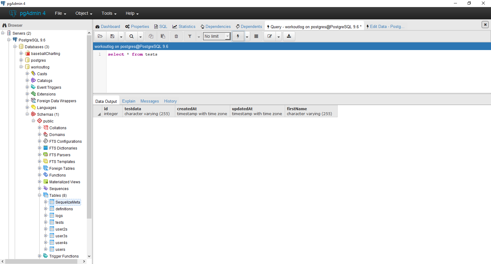
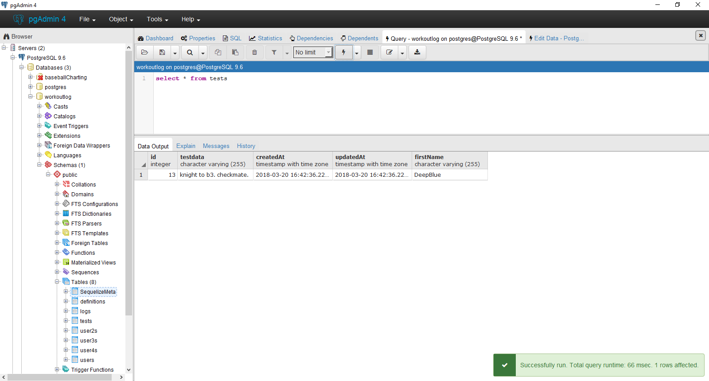

# REVERTING SEEDS
---

Just like migration files, seed files can be reverted. You still need to be careful what you revert, however. In the seed from the previous module, if we were to revert using `db:seed:undo:all`, the `down` function deletes everything because it sets `null` to the tests table. In fact, when testing this out, we proved it: <br>
 <br>

In order to revert just one seed, we need to tell the `down` function to search for something specific. Take this table, for example: <br>
 <br>
We could search for the mostly updated row by using the `updatedAt`, or we could search for a specific row by using one of the columns we've provided data for. Let's make sequelize delete a row where `firstName` is `Gary` by making the following change to the `down` function:

```js
return queryInterface.bulkDelete('tests', {firstName: 'Gary'});
```

We remove the `null` argument and add the search term into the object. When run, we get the following result: <br>


### Migration Wrap-up
Migrations are very important to any kind of back-end programming or database job. Doing them incorrectly can be catastrophic, however. Taking the time now to practice using migrations and seeders will be very beneficial in the long run. Consult the sequelize migration tutorial in the beginning of the chapter for any questions you might have, as well as some advanced tips not covered here. Additionally, [this](https://tech.luc.id/sequelize-it-part-1-4bb752097861) tutorial presents the basic concepts covered here in a little more detail, but not as dense as the docs.