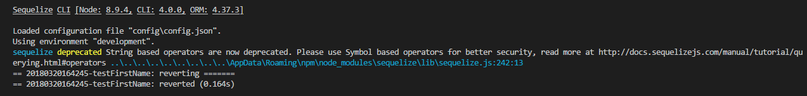
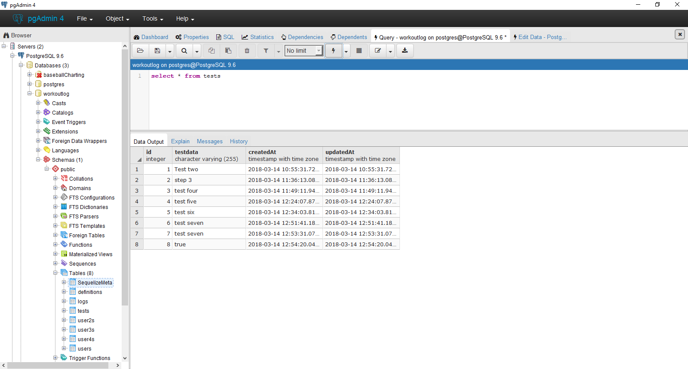

# REVERTING MIGRATIONS
---

Sometimes we want to go back to a previous version of a database. There could've been a problem with a migration, plans for the app may have changed, features may not be needed or ready yet, or any number of things. In these situations, we want to undo our changes to revert to that previous version.

### Undoing a Migration
Think back to our example migration in the previous module. It had both an `up` and a `down` function. This time, we're going to focus on the `down` function. There are a few options for undoing migrations:

|Command|Result|
|:------|:-----|
|db:migrate:undo|Undo the most recent migration|
|db:migrate:undo:all|Undo ALL migrations|
|db:migrate:undo:all --to [filename]|Revert to a specific migration|

In your command window, type in the first command above. You should see a message saying that the migration was reverted. If you refresh your database, the new column will be gone.  

If you run the command again, or run the `undo:all`, the `down` function from the first migration will run, deleting the whole table. Make sure you know what you want to happen when reverting and what version you're reverting to. This is another one of those cases where if you aren't 100% sure that that's what you want to do, **DON'T DO IT**!!!  

Before we move on, run `sequelize db:migrate` again to add the `firstName` field back to the table. We'll use it in creating the seeds.