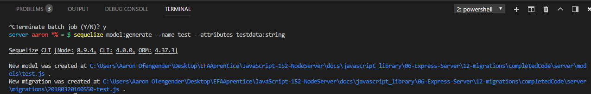

# CREATING YOUR FIRST MIGRATION
---

To create a migration, we first need a model. While we already have models to use, you will need to know how to create one via the command line. We'll only be focusing on the server side in this chapter, so you don't have to worry about the client at all.

### Creating the Model and First Migration
Before we start, go to the models folder in your server and delete `test.js`. If a file is already present with the model name we want to use, it won't allow us to do so. Next, in your terminal window, type the following: `sequelize model:generate --help`. This will bring up the following: <br>
 <br>
While there are many different options, we want to focus on `--name` and `--attributes`. These are required in order to create the model. `--name` will be the name of our model (and become the name of the table in the database), while `--attributes` will be the information we want to store (these will become the columns in our table). In your terminal, type the following command:
```
sequelize model:generate --name test --attributes testdata:string
```
You should see the following: <br>  <br>
This will create a model in the `models` folder called `test`. Take a look at what was created:
```js
'use strict';
module.exports = (sequelize, DataTypes) => {
  var test = sequelize.define('test', {
    testdata: DataTypes.STRING
  }, {});
  test.associate = function(models) {
    // associations can be defined here
  };
  return test;
};
```
Notice that the model is a little different than what we had before. The `use strict` option was added to ES6 to make certain features of JavaScript act like other strongly-typed languages. The `associations` function allow you to create connections between tables within your database, making use of primary and foreign keys. We'll just leave that blank for now. <br>

Another file was also created in the migrations folder: `XXXXXXXXXXXXXX-create-test.js`. The `X`'s are automatically generated by the CLI. You should see today's date at the beginning of the filename; the rest is created according to an algorithm. This is the file that will be used for our first migration, which we'll look at in the next module.