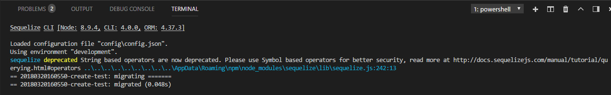
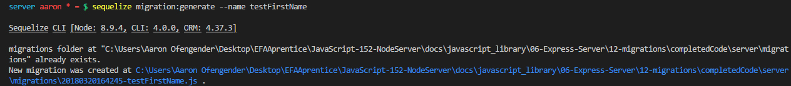
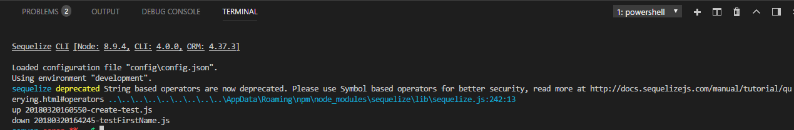
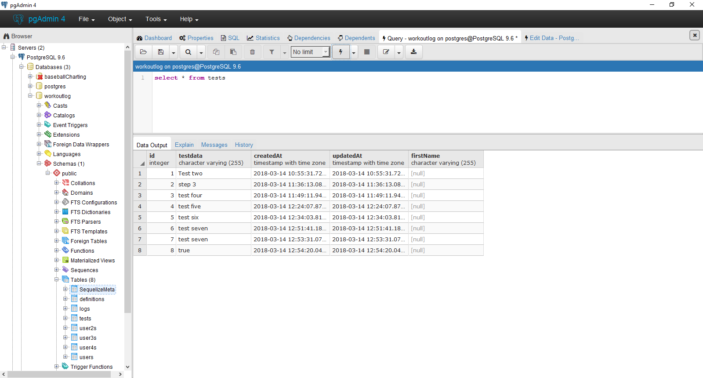

# RUNNING MIGRATIONS
---

Now that we have a model, we're ready to run a migration! Open your terminal and type in the following command:
```
sequelize db:migrate:status
```
This will show you all the database migrations we've created so far. If it says `up`, it means that the migration has been run. If it says `down`, it's waiting for us to run it. Currently, we only have the one, and it should say `down`. Let's look at that file for a moment.

```js
'use strict';
module.exports = { //1
  up: (queryInterface, Sequelize) => { //2
    return queryInterface.createTable('tests', { //3
      id: {
        allowNull: false,
        autoIncrement: true,
        primaryKey: true,
        type: Sequelize.INTEGER
      },
      testdata: {
        type: Sequelize.STRING
      },
      createdAt: {
        allowNull: false,
        type: Sequelize.DATE
      },
      updatedAt: {
        allowNull: false,
        type: Sequelize.DATE
      }
    });
  },
  down: (queryInterface, Sequelize) => { //4
    return queryInterface.dropTable('tests'); //5
  }
};
```
Every migration contains an `up` and a `down` function. These are called when the migration is run or reverted. More on that in a moment.

Here's what's happening here:
1. We export the migration so that Sequelize has access to it.
2. The `up` function is called when we run the migration.
3. This contains the table we're altering, as well as the changes being made.
4. You can undo migrations to return the database to a previous point in time. When you undo (or revert) your changes, the `down` function is called.
5. This is almost always undoing the action from the `up` function.

### Running the Migration
To run our migration, we use the command `db:migrate`. If you add the `--help` attribute, you can see there are other options to add as well. Go to your terminal and run `sequelize db:migrate`. You should see the following in your terminal: <br>  <br>
Open PG Admin and look at your `test` table. Does it look like anything changed? It shouldn't, because it hasn't yet! <br>
Take another look at the migration file above. Notice that the functions each call a method from the `queryInterface` object, which allows us access to sequelize functions and methods. A migration created with `model:generate` will contain the method `createTable`; that is, it will create the table with the information given if that table already exists. We already have a table called `test`, so it does nothing. We need to create a new migration to edit the table.

### Creating a New Migration
Creating a migration is almost the same as creating a model. We just use the command `migration:generate` instead. For this one, however, we only need to supply a name value. When the file is created, it will have the long string of numbers, so add something to the filename so you know what that migration is doing. Let's add a first name column to our table. Run the following command in your terminal:
```
sequelize migration:generate --name testFirstName
```
You should see something like this: <br>  <br>
When run, this command first tries to create the migrations folder; if it already exists, it skips this step. Then the new migration is created. Inside of the file, you'll see this:

```js
'use strict';

module.exports = {
  up: (queryInterface, Sequelize) => {

  },

  down: (queryInterface, Sequelize) => {

  }
};
```
This is the basic syntax for a migration: an export statement, an `up` function, and a `down` function. There's some stuff in comments inside the functions, but we're going to replace that. We want to add a first name column to our table, so we're going to use the `addColumn()` method of the `queryInterface` object. Enter the following code into the `up` method:
```js
    return queryInterface.addColumn('tests', 'firstName', Sequelize.STRING)
```
This tells sequelize what table the new column needs to be entered in to, as well as what the new column is. We use `Sequelize` instead of `DataTypes` for this action. The `down` function should always undo the action of the `up` function so that changes can be undone properly. Put this into the `down` function:

```js
    return queryInterface.removeColumn('tests', 'firstName')
```
This simply removes the new column so that database can revert to its previous status. Now run `db:migrate:status` again. You should see the following: <br>
 <br>
Our first migration has a status of `up` because we ran it earlier. The new migration has a status of `down` because it's waiting to be run. Go ahead and run `db:migrate`, then refresh the `test` table in PG Admin. You should see the following: <br>
 <br>
<br>
You can see that the new column was added to the end of the database, and all of the previous entries have a `null` value for the new column. You can force an existing user to provide that information if you want to, but for now we'll just leave it blank. <br>
The last step is to add the new column to the model so that future entries will be required to enter this information. Add `firstName: DataTypes.STRING` beneath the `testdata` property in the `test` model. Don't forget to add a comma after the `testdata`.<br>

Congratulations! You just migrated a table in your database! Before we move on to seeds, there are a couple of other things that we need to talk about with regards to migrations, most importantly the ability to roll back your changes. That'll be in the next module, but for now take a couple of minutes to read back over this section. We just covered a lot of information, so make sure you take it all in.