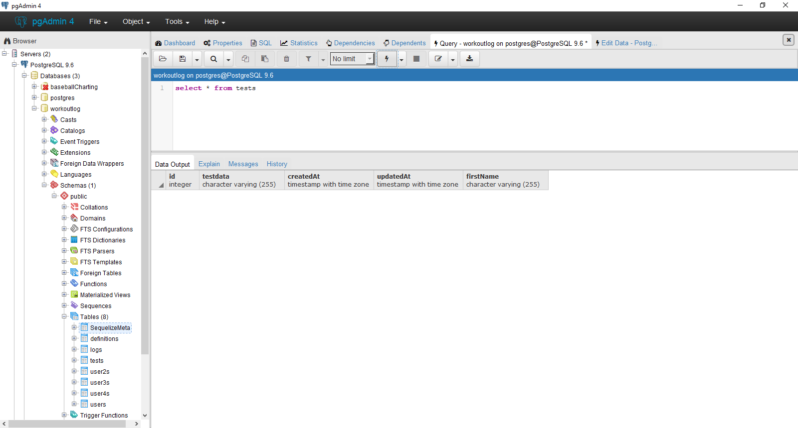
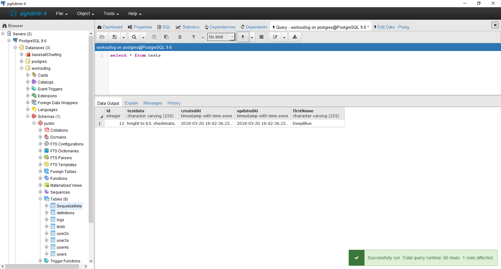

# REVERTING SEEDS
---

Just like migration files, seed files can be reverted. However, you still need to be careful what you revert. In the seed from the previous module, if we were to revert, the `down` function deletes everything because it sets `null` to the tests table. In fact, when testing this out, we proved it: <br>
 <br>

There are two commands that can revert seeds: `db:seed:undo:all` reverts all seeds, while `db:seed:undo --seed [filename]` will revert the most recent seed. However, by default, a list of seeders is not stored in a database table like migrations. Without storing the seeds, we can't revert a single seed. We change this by adding to our `config.json` file.

### Refactor `config.json`
We need to add two lines to our file in each of the three sections: the first tells Sequelize to store the seeds, while the second tells it where to store them. Add the following to the `development` object (You may want to add them to the other two objects as well, just to be safe):
```json
  "development": {
    "username": "postgres", 
    "password": "9074dewberry1136",  
    "database": "workoutlog",
    "host": "127.0.0.1",
    "port": "5432",
    "dialect": "postgres",
    "seederStorage": "sequelize", //<--ADD THIS
    "seederStorageTableName": "sequelize_data" //<---ADD THIS
  }
```
The next time we run a seed, a table called `sequelize_data` will be created in our database with a list of seeds that have been run. We can then use the individual `db:seed:undo` command to revert a single seed. Run `sequelize db:seed:all` to add some data, then refresh your database to make sure that this table was created properly.

### Reverting a Seed
In order to revert just one seed, we need to tell the `down` function to search for something specific. Take this table, for example: <br>
 <br>
We could search for the mostly updated row by using the `updatedAt`, or we could search for a specific row by using one of the columns we've provided data for. Let's make Sequelize delete a row where `firstName` is `Gary` by making the following change to the `down` function:

```js
return queryInterface.bulkDelete('tests', {firstName: 'Gary'});
```

We remove the `null` argument and add the search term into the object. When we run the revert, we get the following result: <br>


### Challenge
Create a new seed with `sequelize seed:generate`, then run `sequelize db:seed:all` to put both seeds' data into the database. Change the `down` function of the new seed to remove its data you just entered (Just the second seed!) and run `sequelize db:seed:undo --seed [newSeed]`. Refresh your database your database to ensure it worked.

### Migration Wrap-Up
Migrations are very important to any kind of back-end programming or database job. Doing them incorrectly can be catastrophic, however. Taking the time now to practice using migrations and seeders will be very beneficial in the long run. Consult the Sequelize migration tutorial in the beginning of the chapter for any questions you might have, as well as some advanced tips not covered here. Additionally, [this](https://tech.luc.id/sequelize-it-part-1-4bb752097861) tutorial presents the basic concepts covered here in a little more detail, but not as densely as the docs.